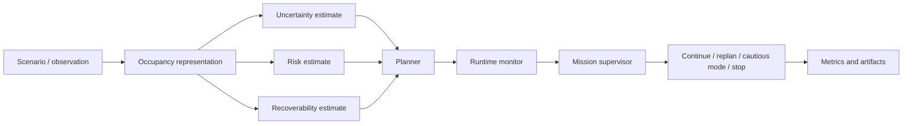

<div align="center">

# DynNav

## Risk-Aware Dynamic Navigation and Rerouting in Unknown Environments

A Python research prototype for deterministic grid navigation, risk-aware planning, uncertainty and recoverability estimates, online rerouting, and mission-level supervision.

[](https://github.com/panagiotagrosdouli/DynNav-Dynamic-Navigation-Rerouting-in-Unknown-Environments/actions/workflows/ci.yml)
[](pyproject.toml)
[](LICENSE)
[](#verified-status)

</div>

<p align="center">
  
</p>

<p align="center"><em>Conceptual generated diagram. It is not experimental evidence or a safety guarantee. No generated GIF is currently present at <code>assets/demo.gif</code>; media generation remains a documented command rather than a committed claim.</em></p>

## Research question

> How can an autonomous mobile robot dynamically replan in a partially observed environment while jointly accounting for occupancy risk, uncertainty, recoverability, dynamic changes, and mission-level safety actions?

DynNav studies whether explicit risk, uncertainty, and recoverability reasoning improves navigation decisions relative to geometric shortest-path planning. The current evidence is primarily deterministic and grid-world based.

## What the robot model does

```text
scenario or observation
  -> occupancy representation
  -> uncertainty, risk, and recoverability estimates
  -> geometric or risk-aware planning
  -> route monitoring and rerouting
  -> nominal, replan, safe-mode, or stop decision
  -> metrics and generated artifacts
```

## Verified status

| Capability | Maturity | Current evidence |
|---|---|---|
| Typed grid, pose, trajectory, and mission primitives | Implemented | Source tests and Python CI |
| A* and Dijkstra baselines | Implemented | Deterministic tests |
| Risk-aware grid planning | Implemented | Source and regression tests |
| Risk and uncertainty fields | Implemented / Experimental | NumPy-based deterministic tests |
| Recoverability estimation | Research Prototype | Grid reachability heuristics and tests |
| Dynamic rerouting and cooldown | Research Prototype | Regression tests, including bounded repeated replanning |
| Mission supervisor | Research Prototype | Rule-based state and threshold tests |
| Benchmark and smoke runners | Implemented / Experimental | GitHub Actions smoke execution |
| Research website | Implemented | Install, TypeScript check, and production build in CI |
| ROS2/Nav2 integration | Planned / Prototype documentation | No compiled plugin claim |
| Gazebo validation | Planned | Not currently claimed |
| Hardware validation | Hardware Validation Required | No physical-robot evidence |
| Formal safety guarantees | Not claimed | Outside available evidence |

## Architecture



See [`docs/SYSTEM_ARCHITECTURE.md`](docs/SYSTEM_ARCHITECTURE.md) and [`docs/NAVIGATION_PIPELINE.md`](docs/NAVIGATION_PIPELINE.md).

## Mathematical formulation

The current conceptual objective is

```math
J(\pi)=w_L L(\pi)+w_R R(\pi)+w_U U(\pi)+w_G G(\pi),
```

where `L` is geometric cost, `R` is path risk, `U` is uncertainty exposure, and `G` is recoverability loss. Terms must be independently configurable, interpretable, and validated before stronger claims are made. Dynamic-obstacle and mission-level terms remain research extensions rather than universally validated components.

See [`docs/MATHEMATICAL_FORMULATION.md`](docs/MATHEMATICAL_FORMULATION.md), [`docs/RISK_ESTIMATION.md`](docs/RISK_ESTIMATION.md), and [`docs/UNCERTAINTY_MODEL.md`](docs/UNCERTAINTY_MODEL.md).

## Installation

```bash
git clone https://github.com/panagiotagrosdouli/DynNav-Dynamic-Navigation-Rerouting-in-Unknown-Environments.git
cd DynNav-Dynamic-Navigation-Rerouting-in-Unknown-Environments
python -m venv .venv
source .venv/bin/activate
python -m pip install --upgrade pip
python -m pip install -e ".[dev]"
```

Windows PowerShell activation:

```powershell
.venv\Scripts\Activate.ps1
python -m pip install -e ".[dev]"
```

## Five-minute quick start

```bash
pytest
python scripts/run_all.py --config configs/default.yaml --smoke --out-dir results/quickstart
python scripts/run_benchmarks.py --config configs/default.yaml --smoke --out-dir results/quickstart_benchmarks
```

The test suite and both smoke entry points are exercised by GitHub Actions on Python 3.10, 3.11, and 3.12.

## Run modes and commands

| Purpose | Command |
|---|---|
| Full Python tests | `pytest` |
| Focused replanning test | `pytest tests/test_realtime_replanning.py` |
| CI-style smoke run | `python scripts/run_all.py --config configs/default.yaml --smoke --out-dir results/ci_smoke` |
| Benchmark smoke run | `python scripts/run_benchmarks.py --config configs/default.yaml --smoke --out-dir results/ci_benchmarks` |
| Installed benchmark CLI | `dynnav-benchmark --config configs/benchmark.yaml --out-csv results/benchmarks/dynnav_benchmark.csv --summary results/benchmarks/summary.md` |
| Generate research assets | `python scripts/generate_research_assets.py` |
| Attempt demo GIF generation | `python scripts/make_demo_gif.py` |

See [`scripts/README.md`](scripts/README.md).

## Configuration

Versioned YAML inputs live under [`configs/`](configs/README.md). Reportable runs must preserve the exact configuration, seed, command, and commit. Comprehensive typed rejection of all pathological parameter combinations is **Pending Validation**.

## Generated artifacts and current results

Generated files belong under [`results/`](results/README.md); diagrams and media belong under [`assets/`](assets/README.md). The repository currently supports deterministic synthetic smoke and benchmark outputs. No committed output should be interpreted as Gazebo or hardware evidence unless its manifest explicitly establishes that provenance.

The root documentation does not state numerical performance improvements because the current audit has not verified a complete multi-seed statistical result set suitable for publication claims.

## Evaluation protocol and metrics

Methods should receive equivalent scenario information and use identical seeds, starts, goals, obstacle changes, and termination conditions.

Current and planned metric families include:

- task performance: success, path length, and goal completion;
- planning: runtime, expanded nodes, replans, and route switches;
- risk: cumulative and peak exposure;
- uncertainty: cumulative and peak exposure;
- recoverability: minimum score and retained escape options;
- supervision: mode transitions, safe-mode requests, and stops.

Metrics require mathematical definitions and provenance. See [`docs/EVALUATION_PROTOCOL.md`](docs/EVALUATION_PROTOCOL.md) and [`docs/REPRODUCIBILITY.md`](docs/REPRODUCIBILITY.md).

## Repository structure

| Directory | Purpose |
|---|---|
| [`configs/`](configs/README.md) | Versioned experiment and benchmark inputs |
| [`src/`](src/README.md) | Installable Python source tree |
| [`src/dynnav/`](src/dynnav/README.md) | Main Python research package |
| [`scripts/`](scripts/README.md) | Smoke, benchmark, experiment, and media entry points |
| [`tests/`](tests/README.md) | Deterministic pytest suite |
| [`docs/`](docs/README.md) | Technical documentation and evidence boundaries |
| [`assets/`](assets/README.md) | Diagrams, figures, GIFs, and media provenance |
| [`results/`](results/README.md) | Generated metrics, reports, figures, and manifests |
| [`paper/`](paper/README.md) | Paper-facing material and evidence requirements |
| [`website/`](website/README.md) | Next.js research landing page |

Directories are documented only when they have a distinct technical or reproducibility responsibility. Separate mapping, prediction, risk, uncertainty, recoverability, safety, simulation, visualization, or ROS2 READMEs should be added only when those responsibilities exist as real directory boundaries on `main`.

## Documentation index

Start with [`docs/README.md`](docs/README.md) and [`docs/REPOSITORY_AUDIT.md`](docs/REPOSITORY_AUDIT.md). The latter is the authoritative list of implemented, prototype, planned, and unvalidated capabilities.

## Website

```bash
cd website
npm install --no-audit --no-fund
npm run typecheck
npm run build
npm run dev
```

A lockfile-backed `npm ci` workflow remains pending unless a valid lockfile is present and used by CI.

## Docker

```bash
docker build -t dynnav .
docker run --rm dynnav
```

Docker execution is **Pending Validation** in the current audit. The commands are documented because a root [`Dockerfile`](Dockerfile) exists, not because runtime behavior has been fully reproduced in this session.

## ROS2 and Nav2 status

ROS2/Nav2 material is a **Research Prototype / Planned Integration**. No production-ready `nav2_core::GlobalPlanner`, pluginlib discovery, Nav2 launch, Gazebo run, or robot path execution is claimed. See [`docs/ROS2_NAV2_INTEGRATION.md`](docs/ROS2_NAV2_INTEGRATION.md).

## Limitations

- Current evidence is primarily deterministic grid-world evidence.
- Uncertainty aggregation is not claimed to be calibrated.
- Recoverability remains heuristic and scenario-dependent.
- Dynamic-agent handling is not yet a validated probabilistic space-time system.
- Supervisor behavior is rule-based and not formally certified.
- Docker, recursive link auditing, ROS2, Nav2, Gazebo, and hardware validation require additional execution evidence.
- Passing tests does not prove navigation safety.

## Research roadmap

1. Complete repository-wide configuration, terminology, test, and documentation validation.
2. Define mathematically valid risk, VaR/CVaR, uncertainty, and recoverability interfaces.
3. Add transparent dynamic-agent prediction and space-time risk baselines.
4. Add minimal time-aware planning and controlled ablations.
5. Formalize supervisor transitions and explanations.
6. Compile and validate a real ROS2/Nav2 package.
7. Run reproducible Gazebo scenarios and statistical comparisons.
8. Generate paper figures and tables only from raw, traceable results.

## Responsible use

DynNav is research software. It must not be used as a certified safety controller or as the sole navigation system for safety-critical deployment. Users are responsible for independent validation, fail-safe behavior, applicable standards, and hardware-specific testing.

## Citation

Use [`CITATION.cff`](CITATION.cff) for repository citation until a peer-reviewed publication is available. Do not cite planned contributions as experimentally established results.

## License

Licensed under the Apache License 2.0. See [`LICENSE`](LICENSE).
