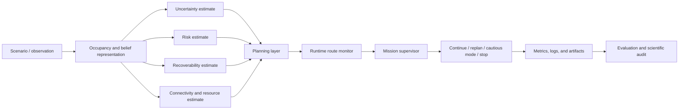

<div align="center">

# DynNav

## Risk-Aware Dynamic Navigation and Rerouting in Unknown Environments

**A modular research framework for autonomous navigation under uncertainty, risk, limited recoverability, dynamic change, and mission-level constraints.**

[](https://github.com/panagiotagrosdouli/DynNav-Dynamic-Navigation-Rerouting-in-Unknown-Environments/actions/workflows/ci.yml)
[](pyproject.toml)
[](LICENSE)
[](#verified-status-and-evidence-boundaries)
[](app/dashboard.py)

[**English**](README.md) · [**Ελληνικά**](README_GREEK.md) · [Documentation](docs/README.md) · [Contribution index](contributions/CONTRIBUTIONS_README.md) · [Streamlit dashboard](#interactive-streamlit-dashboard) · [Website](website/README.md)

</div>

<p align="center">
  
</p>

<p align="center"><em>Figure 1 — Conceptual DynNav system overview. The figure explains the intended information flow; it is not experimental evidence, a formal safety proof, or a hardware-validation claim.</em></p>

---

## Abstract

Autonomous navigation in an unknown or changing environment is not only a shortest-path problem. A robot must make decisions while its map may be incomplete, its state estimate uncertain, its sensors noisy, its communication link degraded, and its future ability to recover from a decision unknown. A geometrically valid route may therefore still be operationally unsafe, difficult to reverse, energy-infeasible, or poorly supported by available evidence.

**DynNav** investigates this broader decision problem through a modular collection of planning, uncertainty, risk, recoverability, supervision, learning, security, and multi-robot contributions. The framework combines deterministic grid-based baselines with research prototypes for learning-augmented A*, uncertainty calibration, risk-aware planning, returnability analysis, safe-mode supervision, resource-aware routing, next-best-view exploration, online rerouting, and higher-level extensions.

The central design principle is that every navigation decision should remain **auditable**. DynNav therefore separates implemented behavior from planned capability, empirical observations from theoretical guarantees, and conceptual architecture from validated evidence. The repository is intended as a reproducible research platform and thesis-scale engineering study—not as a certified safety controller or a claim of production-ready autonomous navigation.

---

## Research problem

The project studies the following overarching question:

> **How can an autonomous mobile robot dynamically plan and replan in a partially observed environment while explicitly accounting for uncertainty, risk, recoverability, resource constraints, dynamic changes, and mission-level safety actions?**

This question is decomposed into a set of narrower research questions:

1. Can learned guidance reduce graph-search effort without obscuring A* optimality conditions?
2. Can uncertainty estimates be audited and calibrated before they influence planning?
3. How should path length be traded against expected, peak, or tail risk?
4. Can a planner avoid decisions that reduce future returnability or recovery freedom?
5. When should a runtime supervisor switch from nominal navigation to cautious operation or stop?
6. How should energy and communication constraints affect mission feasibility?
7. How should exploration balance information gain against risk, connectivity, and returnability?
8. How should the system respond when the map, route, observations, or trust state changes online?

The remaining contribution modules extend these questions toward security, multi-robot coordination, foundation models, learned world models, formal monitoring, advanced mapping, and swarm-level reasoning.

---

## What was built

DynNav is organized as a layered research system rather than a single monolithic planner.

```text
scenario, map, or observation
        ↓
occupancy and state representation
        ↓
uncertainty, risk, connectivity, and recoverability estimates
        ↓
geometric, learned, risk-aware, or resource-aware planning
        ↓
runtime route monitoring and online replanning
        ↓
mission supervisor: continue / replan / safe mode / stop
        ↓
metrics, benchmark tables, diagnostic logs, and generated artifacts
```

The repository contains:

- typed navigation and mission primitives;
- deterministic A* and Dijkstra baselines;
- learning-augmented heuristic search;
- uncertainty auditing and calibration;
- risk-aware and CVaR-style route analysis;
- returnability, recoverability, and irreversibility metrics;
- finite-state safe-mode supervision;
- energy- and connectivity-aware feasibility classification;
- returnability-aware next-best-view scoring;
- online replanning and route-monitoring experiments;
- an interactive Streamlit visualization of the closed-loop navigation process;
- security, multi-robot, semantic, learning, and formal-method extensions;
- versioned configurations, tests, benchmark runners, and documentation audits.

Each numbered contribution is designed to answer a specific research question and to expose its assumptions, metrics, limitations, and integration points.

---

## Scientific contributions

### 1. Learning-augmented search

Contribution 01 studies whether a neural cost-to-go estimate can reduce A* node expansions. It explicitly separates a raw learned heuristic from a Manhattan-clipped mode, because lower search effort and admissibility are different scientific properties.

### 2. Uncertainty estimation and calibration

Contribution 02 distinguishes uncertainty estimation, informativeness, and probabilistic calibration. Raw uncertainty is audited against observed error before being passed to downstream planners.

### 3. Risk-aware planning

Contribution 03 treats navigation as a safety–efficiency trade-off. Candidate routes can be compared using path length, expected risk, maximum risk, tail risk, and Pareto dominance.

### 4. Returnability and recoverability

Contribution 04 asks whether a robot will retain recovery freedom after committing to a state or route. It introduces measurable signals for returnability, bottlenecks, escape options, recoverability, and irreversibility.

### 5. Safe-mode navigation

Contribution 05 implements a finite-state runtime supervisor with nominal, cautious, and emergency-stop states. Hysteresis, persistence, cooldown, transition logging, and threshold sensitivity reduce unstable mode switching.

### 6. Energy and connectivity constraints

Contribution 06 evaluates mission feasibility under battery reserve and communication constraints. Routes are classified as directly feasible, requiring recharge, requiring relay support, requiring both, or infeasible.

### 7. Safe active exploration

Contribution 07 extends next-best-view selection beyond information gain per travel cost. Candidate viewpoints are also evaluated using route risk, returnability, and connectivity.

### 8–26. Extended research modules

The remaining modules investigate security and anomaly detection, multi-robot coordination, human-language interfaces, vision-language navigation, diffusion occupancy prediction, latent world models, causal risk attribution, neuromorphic sensing, federated navigation learning, semantic-topological maps, formal safety shields, multimodal failure explanation, curriculum learning, advanced mapping, neural scene representations, swarm consensus, and recoverability theory.

These later modules vary in maturity. Their presence in the repository does not imply equal experimental validation or production readiness.

---

## System architecture



The architecture follows three principles:

- **Modularity:** each estimate or decision layer can be evaluated independently.
- **Traceability:** reportable outputs must preserve configuration, seed, command, and commit.
- **Evidence separation:** a feature is not described as validated merely because a conceptual interface or prototype exists.

Detailed architecture documents are available in [`docs/SYSTEM_ARCHITECTURE.md`](docs/SYSTEM_ARCHITECTURE.md) and [`docs/NAVIGATION_PIPELINE.md`](docs/NAVIGATION_PIPELINE.md).

---

## Mathematical formulation

Let a candidate route be denoted by

```math
\pi=(x_0,x_1,\ldots,x_T).
```

A general DynNav planning objective can be written as

```math
J(\pi)=w_L L(\pi)+w_R R(\pi)+w_U U(\pi)+w_G G(\pi)+w_E E(\pi)+w_C C(\pi),
```

where:

- `L(π)` is geometric or traversal cost;
- `R(π)` is expected, maximum, or tail-risk exposure;
- `U(π)` is uncertainty exposure;
- `G(π)` is recoverability loss or irreversibility cost;
- `E(π)` is energy consumption or reserve violation;
- `C(π)` is connectivity degradation.

The route-selection problem is then

```math
\pi^*=\arg\min_{\pi\in\Pi_{\mathrm{feasible}}}J(\pi),
```

subject to module-specific constraints such as collision avoidance, resource feasibility, minimum connectivity, returnability thresholds, or supervisor-imposed operating modes.

This expression is a unifying formulation. Not every experiment activates every term, and no universal proof is claimed for the complete combined objective. Individual contributions define and evaluate smaller, auditable subproblems.

See [`docs/MATHEMATICAL_FORMULATION.md`](docs/MATHEMATICAL_FORMULATION.md), [`docs/RISK_ESTIMATION.md`](docs/RISK_ESTIMATION.md), and [`docs/UNCERTAINTY_MODEL.md`](docs/UNCERTAINTY_MODEL.md).

---

## Research methodology

DynNav follows an evidence-oriented workflow:

1. **Define the navigation failure mode.** Examples include heuristic overestimation, uncertainty miscalibration, excessive path risk, low returnability, resource depletion, or unstable replanning.
2. **Construct an interpretable baseline.** Classical A*, Dijkstra, threshold policies, or information-gain scoring provide reference behavior.
3. **Introduce one explicit mechanism.** Each contribution adds a measurable estimator, objective term, controller, or audit layer.
4. **Evaluate on matched scenarios.** Compared methods receive the same maps, starts, goals, seeds, obstacle changes, and stopping conditions.
5. **Report multiple metrics.** Path quality, runtime, expansions, risk, uncertainty, recoverability, transitions, and feasibility are kept separate.
6. **State evidence boundaries.** Finite benchmarks do not establish universal optimality, safety, calibration, or generalization.

This structure is intended to make negative results and trade-offs visible. For example, fewer A* expansions may coexist with higher wall-clock runtime, and lower route risk may require greater path length.

---

## Verified status and evidence boundaries

| Capability | Maturity | Current evidence |
|---|---|---|
| Typed grid, pose, trajectory, and mission primitives | Implemented | Source tests and Python CI |
| A* and Dijkstra baselines | Implemented | Deterministic tests |
| Risk-aware grid planning | Implemented | Source and regression tests |
| Risk and uncertainty fields | Implemented / Experimental | NumPy-based deterministic tests |
| Interactive Streamlit dashboard | Implemented / Experimental | Synthetic closed-loop visualization |
| Learned heuristic search | Research Prototype | Controlled grid benchmarks and audits |
| Uncertainty calibration | Research Prototype | Synthetic and generated uncertainty-error benchmarks |
| Recoverability estimation | Research Prototype | Grid reachability heuristics and tests |
| Dynamic rerouting and cooldown | Research Prototype | Regression tests for bounded repeated replanning |
| Mission supervisor and safe mode | Research Prototype | Rule-based transition and threshold tests |
| Benchmark and smoke runners | Implemented / Experimental | GitHub Actions smoke execution |
| Research website | Implemented | Install, type-check, and production-build workflow |
| ROS 2 / Nav2 integration | Planned / Prototype documentation | No production-ready plugin claim |
| Gazebo validation | Planned | Not currently claimed |
| Physical-robot validation | Hardware Validation Required | No hardware evidence claimed |
| End-to-end formal safety | Not claimed | Outside the currently established evidence |

Passing tests establishes consistency with implemented expectations; it does not prove navigation safety, real-world robustness, or generalization beyond the tested scenarios.

---

## Installation

```bash
git clone https://github.com/panagiotagrosdouli/DynNav.git
cd DynNav
python -m venv .venv
source .venv/bin/activate
python -m pip install --upgrade pip
python -m pip install -e ".[dev,dashboard]"
```

Windows PowerShell:

```powershell
.venv\Scripts\Activate.ps1
python -m pip install -e ".[dev,dashboard]"
```

---

## Five-minute reproducibility check

Run the following commands from the repository root:

```bash
pytest
python scripts/run_all.py --config configs/default.yaml --smoke --out-dir results/quickstart
python scripts/run_benchmarks.py --config configs/default.yaml --smoke --out-dir results/quickstart_benchmarks
python scripts/validate_documented_commands.py --root .
```

The smoke runners exercise the integrated Python workflow without implying full experimental reproduction of every contribution.

---

## Interactive Streamlit dashboard

The Streamlit application provides an interactive explanation of what happens inside DynNav during a synthetic navigation episode. It is implemented in [`app/dashboard.py`](app/dashboard.py) and uses the deterministic engine under [`src/dynnav_dashboard/`](src/dynnav_dashboard/).

Run it from the repository root:

```bash
python -m pip install -e ".[dashboard]"
streamlit run app/dashboard.py
```

The dashboard includes:

- deterministic scenario generation controlled by a seed;
- static and moving obstacles;
- occupancy, uncertainty, and risk overlays;
- classical A* and risk-aware A* comparison;
- step-by-step robot motion;
- online route invalidation and replanning;
- explanatory supervisor states: `NORMAL`, `CAUTION`, `REPLAN`, `SAFE STOP`, and `GOAL REACHED`;
- local risk and uncertainty signals;
- planner expansions, runtime, path cost, and risk metrics;
- a clear separation between demonstrated synthetic behavior and capabilities that still require ROS 2, Gazebo, or hardware validation.

The app is an explanatory research interface. It does not claim that all 26 contribution modules execute together, and it is not evidence of physical-robot safety.

---

## Main commands

| Purpose | Command |
|---|---|
| Full Python tests | `pytest` |
| Focused replanning test | `pytest tests/test_realtime_replanning.py` |
| Launch Streamlit dashboard | `streamlit run app/dashboard.py` |
| CI-style smoke run | `python scripts/run_all.py --config configs/default.yaml --smoke --out-dir results/ci_smoke` |
| Benchmark smoke run | `python scripts/run_benchmarks.py --config configs/default.yaml --smoke --out-dir results/ci_benchmarks` |
| Installed benchmark CLI | `dynnav-benchmark --config configs/benchmark.yaml --out-csv results/benchmarks/dynnav_benchmark.csv --summary results/benchmarks/summary.md` |
| Validate documented commands | `python scripts/validate_documented_commands.py --root .` |
| Generate research assets | `python scripts/generate_research_assets.py` |
| Attempt demo GIF generation | `python scripts/make_demo_gif.py` |

Contribution-specific commands are documented inside each numbered module.

---

## Evaluation protocol

Methods should be evaluated using equivalent scenario information and identical random seeds, starts, goals, obstacle changes, and termination conditions. Reportable runs should preserve:

```text
repository commit
configuration file
random seed
exact command
runtime environment
raw output
aggregated result
figure or table generation step
```

Primary metric families include:

| Family | Representative metrics |
|---|---|
| Task performance | success rate, path length, goal completion |
| Search and planning | expanded nodes, runtime, replans, route switches |
| Risk | cumulative exposure, maximum exposure, CVaR-style tail risk |
| Uncertainty | error correlation, calibration error, empirical coverage |
| Recoverability | returnability, minimum recoverability, escape options |
| Resources | energy margin, connectivity margin, feasibility verdict |
| Supervision | state transitions, safe-mode duration, stop requests |

See [`docs/EVALUATION_PROTOCOL.md`](docs/EVALUATION_PROTOCOL.md) and [`docs/REPRODUCIBILITY.md`](docs/REPRODUCIBILITY.md).

---

## Repository structure

| Directory | Research responsibility |
|---|---|
| [`app/`](app/) | Interactive Streamlit research dashboard |
| [`contributions/`](contributions/) | Numbered research questions, implementations, experiments, and module-level documentation |
| [`src/`](src/README.md) | Installable Python source tree |
| [`src/dynnav/`](src/dynnav/README.md) | Core navigation research package |
| [`src/dynnav_dashboard/`](src/dynnav_dashboard/) | Synthetic dashboard engine and contribution visualizations |
| [`configs/`](configs/README.md) | Versioned experiment and benchmark inputs |
| [`scripts/`](scripts/README.md) | Smoke, benchmark, validation, and media entry points |
| [`tests/`](tests/README.md) | Deterministic and regression tests |
| [`docs/`](docs/README.md) | Architecture, mathematical definitions, audits, and evidence boundaries |
| [`assets/`](assets/README.md) | Diagrams, figures, media, and provenance |
| [`results/`](results/README.md) | Generated metrics, tables, summaries, and manifests |
| [`paper/`](paper/README.md) | Paper-facing material and publication evidence requirements |
| [`website/`](website/README.md) | Research landing page |

Each mature contribution should contain an English `README.md`, a Greek `README_GR.md`, an explanatory figure under `assets/`, implementation code, experiments, and traceable results where available.

---

## How the contributions connect

```text
C01 learned search
       ↓
C02 uncertainty calibration
       ↓
C03 risk-aware planning ───────┐
       ↓                       │
C04 recoverability             │
       ↓                       │
C05 safe-mode supervision ◄────┘
       ↓
C06 resource feasibility
       ↓
C07 safe exploration
       ↓
C08–C26 security, multi-robot, semantic, learning,
        prediction, mapping, formal, and swarm extensions
```

This dependency graph is conceptual rather than a claim that all modules currently execute as one validated end-to-end robot stack.

---

## Limitations

- Current evidence is dominated by deterministic or synthetic grid-world experiments.
- The Streamlit dashboard is an explanatory synthetic interface, not ROS 2 or hardware execution.
- Some modules are complete implementations; others are research prototypes or interface studies.
- Calibration can degrade under distribution shift.
- Recoverability metrics are interpretable heuristics rather than universal safety certificates.
- Rule-based supervisors depend on threshold selection and scenario design.
- Neural inference can increase runtime even when it reduces search effort.
- Dynamic-agent handling is not yet a fully validated probabilistic space-time system.
- ROS 2, Nav2, Gazebo, Docker, and hardware workflows require additional execution evidence.
- No repository result should be interpreted as a formal end-to-end safety guarantee.

---

## Research roadmap

1. Complete bilingual, contribution-level scientific documentation and visual standardization.
2. Strengthen statistical evaluation with controlled multi-seed studies and uncertainty intervals.
3. Define calibrated interfaces among uncertainty, risk, recoverability, and supervision.
4. Add transparent dynamic-agent prediction and time-aware planning baselines.
5. Evaluate robustness under map shift, sensor degradation, communication loss, and adversarial conditions.
6. Compile and validate a real ROS 2 / Nav2 integration.
7. Run reproducible Gazebo experiments with traceable scenario manifests.
8. Conduct physical-robot validation with hardware-specific fail-safe mechanisms.
9. Generate publication figures and tables exclusively from raw, versioned outputs.

---

## Responsible use

DynNav is research software. It must not be used as a certified safety controller or as the sole navigation system for safety-critical deployment. Real-world users must provide independent validation, emergency handling, applicable standards compliance, hardware-specific safety mechanisms, and operational supervision.

---

## Citation

Use [`CITATION.cff`](CITATION.cff) for repository citation until a peer-reviewed publication is available. Academic use should report the exact commit, configuration, seed, contribution mode, model checkpoint where applicable, and experiment command.

```bibtex
@software{dynnav,
  author  = {Grosdouli, Panagiota},
  title   = {DynNav: Risk-Aware Dynamic Navigation and Rerouting in Unknown Environments},
  url     = {https://github.com/panagiotagrosdouli/DynNav},
  note    = {Research software; cite the exact repository commit used}
}
```

---

## License

Licensed under the Apache License 2.0. See [`LICENSE`](LICENSE).
