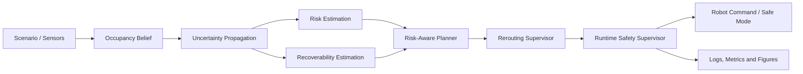

<div align="center">

# DynNav

### Risk-Aware Dynamic Navigation and Rerouting in Unknown Environments

**A research platform for autonomous robots that must replan under uncertainty, dynamic obstacles, and mission-level safety constraints.**

[](https://github.com/panagiotagrosdouli/DynNav-Dynamic-Navigation-Rerouting-in-Unknown-Environments/actions/workflows/ci.yml)
[](pyproject.toml)
[](LICENSE)
[](#research-objective)
[](#project-status)

[Research](#research-objective) · [Method](#method) · [Experiments](#experiments-and-evaluation) · [Installation](#installation) · [Documentation](#documentation) · [Citation](#citation)

</div>

---

## Overview

DynNav is a research-oriented software platform for studying **dynamic robot navigation in unknown and partially observed environments**. The project investigates how an autonomous robot can reroute online while explicitly accounting for occupancy uncertainty, local risk, dynamic obstacles, recoverability, and mission safety.

Unlike shortest-path navigation alone, DynNav treats navigation as a closed-loop decision problem. A geometrically short route may still be undesirable when it crosses uncertain regions, approaches moving obstacles, or leads the robot into states with limited escape options.

> **Research question:** How can an autonomous robot dynamically reroute in unknown and changing environments while reasoning about uncertainty, risk, recoverability, and mission safety?

**Researcher:** Panagiota Grosdouli  
**Affiliation:** Department of Electrical and Computer Engineering, Democritus University of Thrace

## Research objective

The goal of DynNav is to provide a transparent and reproducible foundation for research on:

- autonomous navigation in unknown environments;
- online replanning and dynamic rerouting;
- risk-aware and uncertainty-aware path planning;
- recoverability-aware autonomous decision-making;
- runtime safety supervision;
- learning-augmented planning interfaces;
- ROS 2 and Nav2 integration.

The repository is designed around scientifically honest experimentation. Implemented capabilities, early prototypes, and future research directions are explicitly separated to avoid unsupported performance or safety claims.

## Research contributions

| Research axis | Current contribution |
|---|---|
| **Belief-aware mapping** | Occupancy-belief grid representation for partially observed environments |
| **Planning baselines** | Deterministic A* and Dijkstra implementations for controlled comparison |
| **Risk-aware planning** | Path optimization that combines geometric cost with risk and uncertainty exposure |
| **Recoverability reasoning** | Estimation of whether future states preserve viable escape or replanning options |
| **Dynamic rerouting** | Trigger logic for blocked, high-risk, uncertain, or poorly recoverable paths |
| **Runtime supervision** | Explicit replan, safe-mode, and safe-stop decisions at mission level |
| **Reproducible evaluation** | Seeded experiments, configuration manifests, CSV/JSON outputs, and automated figures |
| **Robotics integration** | Transparent ROS 2/Nav2 integration scaffold without claiming a completed plugin |

## Method

At time step $t$, the navigation system reasons over:

- robot state $x_t$;
- occupancy belief $b_t$;
- local costmap $C_t$;
- dynamic obstacles $O_t$;
- uncertainty field $U_t$;
- risk field $R_t$;
- recoverability field $\Gamma_t$.

A path $\pi_t$ is selected by balancing geometric path cost with risk exposure, uncertainty exposure, and loss of recoverability. Rerouting is initiated when the current route becomes blocked or when mission thresholds are exceeded.

A conceptual objective is:

$$
J(\pi_t) = L(\pi_t) + \lambda_R \mathcal{R}(\pi_t) + \lambda_U \mathcal{U}(\pi_t) + \lambda_\Gamma \mathcal{G}(\pi_t),
$$

where $L$ denotes path length, $\mathcal{R}$ risk exposure, $\mathcal{U}$ uncertainty exposure, and $\mathcal{G}$ recoverability loss.

The complete notation and decision rules are documented in [`docs/MATHEMATICAL_FORMULATION.md`](docs/MATHEMATICAL_FORMULATION.md).

## Navigation pipeline



The software follows a modular closed-loop architecture:

```text
perception → occupancy belief → uncertainty propagation
           → risk and recoverability fields → planning
           → rerouting supervision → mission safety supervision
           → metrics, logs and reproducible research artifacts
```

## Project status

DynNav is a **research prototype**, not a certified robotic safety system.

| Component | Status | Evidence |
|---|---|---|
| Typed grid, pose, trajectory, and mission-state primitives | Implemented | `src/dynnav/core.py`, tests |
| A* and Dijkstra baselines | Implemented | `src/dynnav/lab_grade.py`, tests |
| Risk-aware A* planning | Implemented | `src/dynnav/planning.py`, tests |
| Risk, uncertainty, and recoverability fields | Implemented | deterministic NumPy implementation and tests |
| Dynamic rerouting trigger and cooldown | Prototype | threshold supervisor and tests |
| Runtime safety supervisor | Prototype | explicit safe-stop, safe-mode, and replan policy |
| Reproducible experiment manifest | Implemented | `configs/research_suite.yaml` |
| CSV/JSON research-suite runner | Prototype | `scripts/run_research_suite.py` |
| Automated figures and demo generation | Implemented | script-level outputs |
| ROS 2 / Nav2 integration | Prototype | documentation and scaffold only |
| Formal guarantees and hardware validation | Planned | future theoretical and experimental work |

**Status vocabulary**

- **Implemented:** executable code exists and is supported by tests or smoke workflows.
- **Prototype:** an initial implementation or interface exists, but validation is incomplete.
- **Planned:** a documented research direction without a completed implementation.

## Repository structure

```text
DynNav/
├── configs/          # Experiment and benchmark configurations
├── src/dynnav/       # Core Python research package
├── scripts/          # Benchmark, figure, and demo entry points
├── tests/            # Automated test suite
├── docs/             # Scientific and engineering documentation
├── paper/            # Manuscript-facing material
├── website/          # Research website scaffold
├── assets/           # Diagrams, images, and demo media
├── results/          # Generated metrics, summaries, figures, and videos
└── .github/          # Continuous integration workflows
```

## Installation

### Local development

```bash
git clone https://github.com/panagiotagrosdouli/DynNav-Dynamic-Navigation-Rerouting-in-Unknown-Environments.git
cd DynNav-Dynamic-Navigation-Rerouting-in-Unknown-Environments

python -m venv .venv
source .venv/bin/activate
pip install -e ".[dev]"
```

On Windows PowerShell, activate the environment with:

```powershell
.venv\Scripts\Activate.ps1
```

### Docker

```bash
docker build -t dynnav .
docker run --rm dynnav
```

## Quick start

Run the complete test suite:

```bash
pytest
```

Run the deterministic research-suite smoke experiment:

```bash
python scripts/run_research_suite.py --out-dir results/research_suite
```

Run the benchmark entry point:

```bash
dynnav-benchmark \
  --config configs/benchmark.yaml \
  --out-csv results/benchmarks/dynnav_benchmark.csv \
  --summary results/benchmarks/summary.md
```

Generate research figures and demo media:

```bash
python scripts/generate_research_assets.py
python scripts/make_demo_gif.py
```

Expected artifacts include architecture diagrams, navigation-pipeline figures, risk heatmaps, trajectory plots, uncertainty visualizations, a demo GIF, and—when local codecs are available—an MP4 video.

## Experiments and evaluation

DynNav supports deterministic comparison of planning and rerouting strategies. The evaluation protocol tracks:

| Category | Metrics |
|---|---|
| **Task performance** | success rate, path length, goal completion |
| **Computational performance** | planning time, expanded nodes |
| **Safety proxies** | collision proxy, near-miss proxy, risk exposure |
| **Uncertainty** | cumulative uncertainty exposure |
| **Adaptation** | reroute count and replanning behavior |
| **Recoverability** | terminal recoverability and loss of escape options |
| **Mission supervision** | nominal, replan, safe-mode, and safe-stop states |

Failed planning episodes remain in experiment outputs rather than being silently discarded. Reported results should always be traceable to committed configurations, random seeds, software versions, and generated output files.

See [`docs/EVALUATION_PROTOCOL.md`](docs/EVALUATION_PROTOCOL.md) and [`docs/REPRODUCIBILITY.md`](docs/REPRODUCIBILITY.md).

## ROS 2 and Nav2

ROS 2/Nav2 support is currently at **prototype** level. The intended integration path is a Nav2 global-planner interface that:

- consumes occupancy-grid information;
- computes risk, uncertainty, and recoverability layers;
- publishes diagnostic grids and safety events;
- exposes rerouting and safety-mode decisions to a behavior tree.

No compiled production-ready Nav2 plugin, Gazebo validation, or hardware validation is currently claimed. Integration details are available in [`docs/ROS2_NAV2_INTEGRATION.md`](docs/ROS2_NAV2_INTEGRATION.md).

## Documentation

| Document | Purpose |
|---|---|
| [`RESEARCH_OVERVIEW`](docs/RESEARCH_OVERVIEW.md) | Motivation, research scope, and limitations |
| [`MATHEMATICAL_FORMULATION`](docs/MATHEMATICAL_FORMULATION.md) | Formal model, objectives, and rerouting rules |
| [`SYSTEM_ARCHITECTURE`](docs/SYSTEM_ARCHITECTURE.md) | Software and runtime architecture |
| [`NAVIGATION_PIPELINE`](docs/NAVIGATION_PIPELINE.md) | Closed-loop navigation workflow |
| [`UNCERTAINTY_MODEL`](docs/UNCERTAINTY_MODEL.md) | Belief-grid and uncertainty representation |
| [`RISK_ESTIMATION`](docs/RISK_ESTIMATION.md) | Risk metrics and CVaR-style summaries |
| [`EVALUATION_PROTOCOL`](docs/EVALUATION_PROTOCOL.md) | Experimental methodology and reporting rules |
| [`REPRODUCIBILITY`](docs/REPRODUCIBILITY.md) | Deterministic execution and environment setup |
| [`ROS2_NAV2_INTEGRATION`](docs/ROS2_NAV2_INTEGRATION.md) | Robotics middleware integration plan |
| [`ROADMAP`](docs/ROADMAP.md) | Staged future research work |
| [`REPOSITORY_AUDIT`](docs/REPOSITORY_AUDIT.md) | Scientific, engineering, and presentation audit |

## Limitations

- The current implementation is primarily grid-world oriented.
- Dynamic-obstacle handling remains a deterministic prototype.
- ROS 2/Nav2 support is not yet a compiled plugin.
- No physical-robot or Gazebo validation is currently claimed.
- The project does not provide formal safety guarantees.
- Benchmark values should not be presented as research results unless they are generated by the provided scripts and accompanied by their exact experimental configuration.

## Research roadmap

1. Belief-space planning with learned uncertainty calibration.
2. Recoverability-aware model predictive control.
3. Risk-sensitive prediction of dynamic obstacles.
4. Formal analysis of rerouting stability and safety-mode switching.
5. ROS 2/Nav2 implementation and simulation-based validation.
6. Physical robot experiments with reproducible sensor and mission logs.

## Research website

A Next.js, TypeScript, Tailwind CSS, and Framer Motion research-site scaffold is included in `website/`.

```bash
cd website
npm install
npm run dev
```

## Citation

Citation metadata is provided in [`CITATION.cff`](CITATION.cff). Manuscript-facing material is available under `paper/`.

```bibtex
@software{grosdouli_dynnav,
  author  = {Grosdouli, Panagiota},
  title   = {DynNav: Risk-Aware Dynamic Navigation and Rerouting in Unknown Environments},
  year    = {2026},
  url     = {https://github.com/panagiotagrosdouli/DynNav-Dynamic-Navigation-Rerouting-in-Unknown-Environments}
}
```

## License

This project is released under the [Apache License 2.0](LICENSE).

---

<div align="center">

**DynNav explores autonomous navigation beyond shortest paths—toward robots that reason about uncertainty, risk, and the ability to recover.**

</div>
