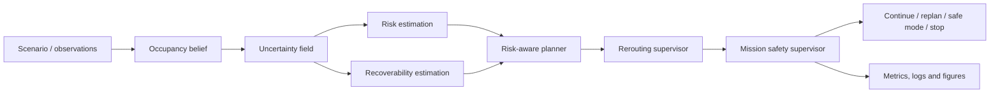

<div align="center">

# DynNav

### Risk-Aware Dynamic Navigation and Rerouting in Unknown Environments

**A research platform for robots that must replan under uncertainty, dynamic obstacles, and mission-level safety constraints.**

[](https://github.com/panagiotagrosdouli/DynNav-Dynamic-Navigation-Rerouting-in-Unknown-Environments/actions/workflows/ci.yml)
[](pyproject.toml)
[](LICENSE)
[](#scope-and-evidence)

[Vision](#research-vision) · [Method](#navigation-objective) · [Evidence](#scope-and-evidence) · [Run](#quick-start) · [Evaluate](#evaluation) · [Roadmap](#research-roadmap)

</div>

<p align="center">
  
</p>

<p align="center"><em>Generated explanatory visual. It illustrates the research architecture; it is not experimental evidence or a formal safety guarantee.</em></p>

> **Research question**  
> How can an autonomous robot reroute online in an unknown and changing environment while reasoning jointly about occupancy uncertainty, local risk, dynamic obstacles, recoverability, and mission safety?

---

## Research vision

Shortest paths are not always safe paths. A geometrically efficient route can cross poorly observed space, approach a moving obstacle, or lead into a region from which recovery is difficult.

DynNav treats navigation as a continuously updated decision loop:

```text
observe → update belief → estimate uncertainty and risk
        → evaluate recoverability → plan or reroute
        → supervise mission safety → continue, degrade, or stop
```

The project studies transparent and reproducible navigation under partial observability. It separates executable components, early prototypes, and future research directions rather than presenting unsupported deployment or safety claims.

---

## At a glance

| Research capability | Current status | Evidence |
|---|---:|---|
| Typed grid, pose, trajectory, and mission-state primitives | Implemented | Source code and tests |
| A* and Dijkstra baselines | Implemented | Deterministic tests |
| Risk-aware A* planning | Implemented | Source code and tests |
| Risk, uncertainty, and recoverability fields | Implemented | NumPy implementation and tests |
| Dynamic rerouting trigger and cooldown | Prototype | Supervisor tests |
| Mission-level safety supervisor | Prototype | Replan, safe-mode, and safe-stop policy |
| Research-suite runner and manifests | Prototype | CSV/JSON outputs and committed configuration |
| Figure and demo generation | Implemented | Script-generated artifacts |
| ROS 2 / Nav2 integration | Prototype | Documentation and scaffold only |
| Gazebo or physical-robot validation | Planned | Not currently claimed |
| Formal safety guarantees | Not claimed | Outside current evidence |

---

## Navigation objective

At time step `t`, DynNav reasons over robot state `x_t`, occupancy belief `b_t`, dynamic obstacles `O_t`, uncertainty field `U_t`, risk field `R_t`, and recoverability field `Γ_t`.

A conceptual path objective is

```math
J(\pi_t)
=
L(\pi_t)
+ \lambda_R\mathcal{R}(\pi_t)
+ \lambda_U\mathcal{U}(\pi_t)
+ \lambda_\Gamma\mathcal{G}(\pi_t),
```

where `L` is geometric path cost, `𝓡` is risk exposure, `𝓤` is uncertainty exposure, and `𝓖` is recoverability loss.

The planner can retain the nominal route, trigger a reroute, request a safer operating mode, or stop when mission thresholds are exceeded. Full notation and assumptions are documented in [`docs/MATHEMATICAL_FORMULATION.md`](docs/MATHEMATICAL_FORMULATION.md).

---

## System architecture



The SVG hero is the visual research map; the Mermaid diagram is retained as a machine-readable architecture companion.

---

## Core research contributions

- **Belief-aware mapping:** occupancy-grid representation for partially observed environments.
- **Transparent baselines:** deterministic A* and Dijkstra for controlled comparisons.
- **Risk-aware planning:** route cost combines distance with uncertainty and risk exposure.
- **Recoverability reasoning:** future states are evaluated by whether escape or replanning options remain viable.
- **Dynamic rerouting:** explicit triggers for blocked, uncertain, high-risk, or poorly recoverable routes.
- **Runtime supervision:** mission states include nominal operation, replanning, safe mode, and safe stop.
- **Reproducible evaluation:** seeded configurations, manifests, CSV/JSON outputs, and automated figures.

---

## Installation

```bash
git clone https://github.com/panagiotagrosdouli/DynNav-Dynamic-Navigation-Rerouting-in-Unknown-Environments.git
cd DynNav-Dynamic-Navigation-Rerouting-in-Unknown-Environments
python -m venv .venv
source .venv/bin/activate
python -m pip install -e ".[dev]"
```

Windows PowerShell:

```powershell
.venv\Scripts\Activate.ps1
python -m pip install -e ".[dev]"
```

Docker:

```bash
docker build -t dynnav .
docker run --rm dynnav
```

---

## Quick start

Run tests:

```bash
pytest
```

Run the deterministic research suite:

```bash
python scripts/run_research_suite.py --out-dir results/research_suite
```

Run the benchmark entry point:

```bash
dynnav-benchmark \
  --config configs/benchmark.yaml \
  --out-csv results/benchmarks/dynnav_benchmark.csv \
  --summary results/benchmarks/summary.md
```

Generate research media:

```bash
python scripts/generate_research_assets.py
python scripts/make_demo_gif.py
```

---

## Evaluation

DynNav retains failed episodes rather than silently discarding them. Strategies should be compared using identical maps, seeds, obstacle trajectories, and mission thresholds.

| Dimension | Metrics |
|---|---|
| Task performance | success rate, goal completion, path length |
| Computation | planning time, expanded nodes |
| Safety proxies | collision proxy, near-miss proxy, risk exposure |
| Uncertainty | cumulative uncertainty exposure |
| Adaptation | reroute count and replanning behavior |
| Recoverability | terminal recoverability and loss of escape options |
| Supervision | nominal, replan, safe-mode, and safe-stop states |

Every reported result should map to its exact configuration, random seed, software version, command, and generated outputs. See [`docs/EVALUATION_PROTOCOL.md`](docs/EVALUATION_PROTOCOL.md) and [`docs/REPRODUCIBILITY.md`](docs/REPRODUCIBILITY.md).

---

## Repository map

```text
configs/        versioned experiment and benchmark configurations
src/dynnav/     core navigation research package
scripts/        benchmark, figure, and demo entry points
tests/          deterministic automated tests
docs/           formulation, architecture, evaluation, and integration notes
paper/          manuscript-facing material
website/        research-site scaffold
assets/         visual diagrams and demo media
results/        generated metrics, summaries, figures, and videos
```

---

## ROS 2 and Nav2

ROS 2/Nav2 support is currently a **prototype direction**. The intended integration exposes occupancy information, risk and uncertainty layers, rerouting events, and mission-supervisor decisions to a Nav2-compatible planning and behavior-tree workflow.

No compiled production-ready Nav2 plugin, Gazebo validation, or hardware validation is currently claimed. See [`docs/ROS2_NAV2_INTEGRATION.md`](docs/ROS2_NAV2_INTEGRATION.md).

---

## Limitations

- The current implementation is primarily grid-world oriented.
- Dynamic-obstacle handling remains a deterministic prototype.
- Rerouting and safety decisions rely on configured rules rather than formal verification.
- ROS 2/Nav2 support is a scaffold, not a completed production plugin.
- No Gazebo, physical-robot, field, or certified-safety validation is claimed.
- Generated synthetic metrics must not be presented as real-world navigation benchmarks.

---

## Research roadmap

```text
Controlled grid studies
        ↓
Belief-space and risk-sensitive planning
        ↓
Recoverability-aware MPC
        ↓
Dynamic-obstacle prediction
        ↓
ROS 2 / Nav2 simulation
        ↓
Hardware experiments
        ↓
Formal supervisor analysis
```

Near-term priorities include uncertainty calibration, recoverability-aware control, rerouting-stability analysis, ROS 2/Nav2 implementation, and simulation-based evaluation before physical deployment.

---

## Documentation

- [`RESEARCH_OVERVIEW`](docs/RESEARCH_OVERVIEW.md)
- [`MATHEMATICAL_FORMULATION`](docs/MATHEMATICAL_FORMULATION.md)
- [`SYSTEM_ARCHITECTURE`](docs/SYSTEM_ARCHITECTURE.md)
- [`NAVIGATION_PIPELINE`](docs/NAVIGATION_PIPELINE.md)
- [`UNCERTAINTY_MODEL`](docs/UNCERTAINTY_MODEL.md)
- [`RISK_ESTIMATION`](docs/RISK_ESTIMATION.md)
- [`EVALUATION_PROTOCOL`](docs/EVALUATION_PROTOCOL.md)
- [`REPRODUCIBILITY`](docs/REPRODUCIBILITY.md)
- [`ROS2_NAV2_INTEGRATION`](docs/ROS2_NAV2_INTEGRATION.md)

---

## Citation

```bibtex
@software{grosdouli_dynnav,
  author = {Grosdouli, Panagiota},
  title  = {DynNav: Risk-Aware Dynamic Navigation and Rerouting in Unknown Environments},
  year   = {2026},
  url    = {https://github.com/panagiotagrosdouli/DynNav-Dynamic-Navigation-Rerouting-in-Unknown-Environments}
}
```

Released under the [Apache License 2.0](LICENSE).
