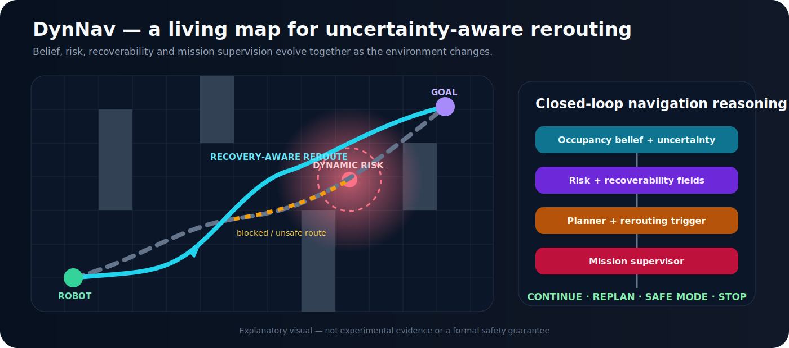

<div align="center">

# DynNav

## Δυναμική Πλοήγηση και Επανασχεδιασμός Διαδρομής με Επίγνωση Κινδύνου σε Άγνωστα Περιβάλλοντα

**Ένα αρθρωτό ερευνητικό framework και διαδραστικό εργαστήριο ρομποτικής για αυτόνομη πλοήγηση υπό αβεβαιότητα, κίνδυνο, περιορισμένη ανακτησιμότητα, δυναμικές αλλαγές και περιορισμούς αποστολής.**

[](https://github.com/panagiotagrosdouli/DynNav/actions/workflows/ci.yml)
[](https://github.com/panagiotagrosdouli/DynNav/actions/workflows/streamlit-dashboard.yml)
[](pyproject.toml)
[](LICENSE)
[](#επαληθευμένο-πεδίο-και-όρια-τεκμηρίωσης)

[English](README.md) · **Ελληνικά** · [Τεκμηρίωση](docs/README.md) · [Κατάλογος Contributions](docs/CONTRIBUTION_FEATURE_CATALOG.md) · [Dashboard](app/README.md)

</div>

<p align="center">
  
</p>

<p align="center"><em>Εννοιολογική επισκόπηση του DynNav. Το διάγραμμα εξηγεί τη ροή πληροφορίας και αποφάσεων· δεν αποτελεί πειραματική απόδειξη, τυπική εγγύηση ασφάλειας ή επικύρωση σε πραγματικό ρομπότ.</em></p>

---

## Περίληψη

Η αυτόνομη πλοήγηση σε άγνωστα ή μεταβαλλόμενα περιβάλλοντα δεν είναι μόνο πρόβλημα εύρεσης της συντομότερης διαδρομής. Ένα ρομπότ πρέπει να αποφασίζει ενώ ο χάρτης μπορεί να είναι ελλιπής, η θέση του αβέβαιη, οι αισθητήρες θορυβώδεις, οι επικοινωνίες υποβαθμισμένες, τα εμπόδια δυναμικά και η δυνατότητα ανάκαμψης από μια κακή απόφαση περιορισμένη.

Το **DynNav** μελετά αυτό το ευρύτερο πρόβλημα μέσα από ντετερμινιστικά baselines, ερευνητικά prototypes, διαδραστικές επιδείξεις, αναπαραγώγιμα πειράματα και τεκμηρίωση προσανατολισμένη σε evidence. Η κεντρική αρχή σχεδιασμού είναι ότι κάθε απόφαση πλοήγησης πρέπει να παραμένει **ελέγξιμη και ερμηνεύσιμη**: οι παραδοχές, οι παράμετροι, οι διαδρομές, ο κίνδυνος, η αβεβαιότητα, οι μεταβάσεις του supervisor, οι μετρικές και οι περιορισμοί πρέπει να είναι ορατά.

Το repository περιλαμβάνει 26 θεματικές ερευνητικές συνεισφορές, ένα multipage Streamlit εργαστήριο, deterministic tests, experiment manifests, αναφορές, exports και εργαλεία αξιολόγησης. Η τρέχουσα τεκμηρίωση αφορά κυρίως synthetic και grid-world evidence. Δεν διεκδικείται πιστοποιημένη ασφάλεια, production readiness, φυσική επικύρωση ή καθολική γενίκευση.

---

## Κεντρικό ερευνητικό ερώτημα

> **Πώς μπορεί ένα αυτόνομο κινητό ρομπότ να σχεδιάζει και να επανασχεδιάζει δυναμικά τη διαδρομή του σε μερικώς παρατηρήσιμο περιβάλλον, λαμβάνοντας ρητά υπόψη αβεβαιότητα, κίνδυνο, ανακτησιμότητα, πόρους, δυναμικές αλλαγές, ασφάλεια, ανθρώπινους περιορισμούς και ενέργειες επιπέδου αποστολής;**

Το DynNav αποσυνθέτει αυτό το ερώτημα σε 26 modules, ώστε κάθε υπόθεση να μπορεί να εξεταστεί και να αξιολογηθεί ανεξάρτητα.

---

## Τι υλοποιήθηκε

```text
σενάριο, χάρτης, παρατήρηση ή αποστολή
        ↓
occupancy και belief representation
        ↓
uncertainty, risk, connectivity, resources και recoverability
        ↓
geometric, learned, risk-aware, semantic ή resource-aware planning
        ↓
route monitoring, prediction και online replanning
        ↓
supervisor: continue / caution / replan / recover / stop
        ↓
metrics, event logs, manifests, reports και evidence audit
```

Το repository περιλαμβάνει:

- typed primitives για grid, pose, trajectory και mission state,
- deterministic A* και Dijkstra baselines,
- learned και risk-aware planning,
- uncertainty estimation και calibration experiments,
- returnability, recoverability και irreversibility metrics,
- finite-state safe-mode supervision,
- energy και connectivity feasibility analysis,
- next-best-view exploration,
- dynamic-obstacle prediction και route invalidation,
- multi-robot coordination και communication experiments,
- security, causal, semantic, learning, formal-method και swarm extensions,
- multipage Streamlit robotics laboratory,
- manifests, replay, reports, exports, Docker, tests και CI validation.

---

## Ενιαία μαθηματική οπτική

Για μια υποψήφια διαδρομή \(\pi\), ένα γενικό πολυκριτηριακό objective μπορεί να γραφτεί ως:

```math
J(\pi)=w_L L(\pi)+w_R R(\pi)+w_U U(\pi)+w_G G(\pi)+w_E E(\pi)+w_C C(\pi),
```

όπου:

- \(L(\pi)\): γεωμετρικό ή χρονικό κόστος,
- \(R(\pi)\): έκθεση σε κίνδυνο,
- \(U(\pi)\): έκθεση σε αβεβαιότητα,
- \(G(\pi)\): απώλεια ανακτησιμότητας,
- \(E(\pi)\): ενεργειακό κόστος,
- \(C(\pi)\): κόστος ή παραβίαση συνδεσιμότητας.

Η βέλτιστη υποψήφια διαδρομή είναι:

```math
\pi^*=\arg\min_{\pi\in\Pi}J(\pi),
```

υπό feasibility, collision, mission και supervisor constraints. Η διατύπωση αυτή είναι ενοποιητική και εννοιολογική. Δεν σημαίνει ότι όλα τα terms είναι ταυτόχρονα ενεργά ή επιστημονικά επικυρωμένα σε κάθε experiment.

---

## Διαδραστικό εργαστήριο ρομποτικής

Εγκατάσταση και εκκίνηση:

```bash
python -m pip install -e ".[dashboard]"
streamlit run app/dashboard.py
```

Το dashboard παρέχει:

| Σελίδα | Λειτουργία |
|---|---|
| **Home** | Επισκόπηση του πλήρους pipeline και πρόσβαση στα εργαστήρια. |
| **Robot Lab** | Play, pause, step, reset, event inspection, replanning και rollout export. |
| **Scenario Builder** | Παραμετροποίηση χαρτών, start/goal, εμποδίων και seeds. |
| **Planner Arena** | Σύγκριση planners στον ίδιο κόσμο και με κοινές μετρικές. |
| **Belief & Mapping Lab** | Sensor noise, prior/posterior occupancy, entropy και information gain. |
| **Risk & Safety Lab** | Σύνθεση risk layers και supervisor thresholds. |
| **Dynamic Obstacles** | Motion models, prediction horizon, uncertainty envelopes και route conflicts. |
| **Multi-Robot Lab** | Robot count, communication range, packet loss, links και fleet conflicts. |
| **Contribution Explorer** | Διαδραστική εξερεύνηση των C01–C26. |
| **Experiment Studio** | Single-seed, multi-seed, baseline και sensitivity experiments. |
| **Results & Reports** | Replay, filtering και export CSV, JSON, Markdown και ZIP. |

Το dashboard είναι synthetic explanatory και experimental interface. Δεν αποδεικνύει ότι όλα τα contributions έχουν ίση ωριμότητα ή ότι λειτουργούν ως ένα ενιαίο πιστοποιημένο robot stack.

---

## Οι 26 ερευνητικές συνεισφορές

### Planning, uncertainty και runtime safety

| ID | Module | Κύρια λειτουργία | Ωριμότητα |
|---|---|---|---|
| C01 | Learned A* | Learned cost-to-go guidance για A*. | Research Prototype |
| C02 | Uncertainty Estimation | Εκτίμηση, audit και calibration αβεβαιότητας. | Research Prototype |
| C03 | Risk-Aware A* | Trade-off μήκους διαδρομής και risk exposure. | Research Prototype |
| C04 | Returnability | Διατήρηση escape και recovery options. | Research Prototype |
| C05 | Safe-Mode Supervisor | Continue, caution, replan ή stop με hysteresis. | Research Prototype |
| C06 | Energy & Connectivity | Mission feasibility με battery και link constraints. | Research Prototype |
| C07 | Safe Next-Best View | Exploration με information gain, risk και returnability. | Research Prototype |

### Security, people, coordination και learning

| ID | Module | Κύρια λειτουργία | Ωριμότητα |
|---|---|---|---|
| C08 | Security IDS | Anomaly και manipulated-observation detection. | Experimental |
| C09 | Multi-Robot | Shared beliefs, communication και task allocation. | Experimental |
| C10 | Human-Aware Navigation | Social costs και personal-space reasoning. | Experimental |
| C11 | Twin-Critic RL | Actor–critic behavior και critic disagreement. | Experimental |
| C12 | Diffusion Occupancy | Uncertain future occupancy prediction. | Experimental |
| C13 | Latent World Model | Imagined rollouts σε latent state space. | Experimental |
| C14 | Causal Risk | Structured attribution και counterfactuals. | Experimental |
| C15 | Neuromorphic Sensing | Event-driven sparse sensing. | Experimental |
| C16 | Federated Learning | Decentralized updates χωρίς raw-data centralization. | Experimental |
| C17 | Semantic Topological Maps | Semantic regions και graph-level planning. | Experimental |
| C18 | Formal Safety Shields | Runtime interventions inspired by CBF/STL. | Experimental |

### Mission reasoning, explanation και robustness

| ID | Module | Κύρια λειτουργία | Ωριμότητα |
|---|---|---|---|
| C19 | Language Mission Planner | Natural-language goals και constraints. | Documentation Concept |
| C20 | Failure Explanation | Structured explanations από events και evidence. | Experimental |
| C21 | PPO Navigation | Policy-optimization behavior. | Experimental |
| C22 | Curriculum RL | Progressive task difficulty και learning stages. | Experimental |
| C23 | Gaussian Splatting Maps | Dense Gaussian scene representation. | Documentation Concept |
| C24 | NeRF Uncertainty | Neural implicit fields με uncertainty views. | Documentation Concept |
| C25 | Adversarial Testing | Disturbance injection και robustness degradation. | Experimental |
| C26 | Byzantine Swarm | Consensus με faulty ή malicious reports. | Experimental |

---

## Επαληθευμένο πεδίο και όρια τεκμηρίωσης

| Ικανότητα | Ωριμότητα | Τρέχον evidence |
|---|---|---|
| Typed navigation primitives | Implemented | Source tests και Python CI |
| A* και Dijkstra baselines | Implemented | Deterministic tests |
| Risk-aware grid planning | Implemented | Source και regression tests |
| Risk και uncertainty fields | Implemented / Experimental | Synthetic deterministic tests |
| Streamlit robotics lab | Implemented / Experimental | Dashboard smoke tests και headless startup CI |
| Experiment manifests, replay και exports | Implemented / Experimental | Deterministic workflows |
| Learned heuristic search | Research Prototype | Controlled grid benchmarks |
| Uncertainty calibration | Research Prototype | Synthetic uncertainty/error studies |
| Recoverability estimation | Research Prototype | Grid heuristics και tests |
| Dynamic rerouting | Research Prototype | Regression tests |
| Safe-mode supervisor | Research Prototype | Transition και threshold tests |
| Docker dashboard runtime | Implemented | Container entry point και health-check validation |
| ROS 2 / Nav2 | Planned / Prototype documentation | Δεν διεκδικείται production-ready integration |
| Gazebo | Planned | Δεν υπάρχει τρέχουσα validation claim |
| Physical robot | Validation Required | Δεν υπάρχει hardware evidence |
| End-to-end formal safety | Not claimed | Εκτός τρέχοντος evidence |

Η επιτυχία tests αποδεικνύει συνέπεια με τις υλοποιημένες προσδοκίες. Δεν αποδεικνύει πραγματική ασφάλεια, robustness ή generalization.

---

## Εγκατάσταση

```bash
git clone https://github.com/panagiotagrosdouli/DynNav.git
cd DynNav
python -m venv .venv
source .venv/bin/activate
python -m pip install --upgrade pip
python -m pip install -e ".[dev,dashboard]"
```

Windows PowerShell:

```powershell
.venv\Scripts\Activate.ps1
python -m pip install -e ".[dev,dashboard]"
```

Docker:

```bash
docker build -t dynnav-streamlit .
docker run --rm -p 8501:8501 dynnav-streamlit
```

---

## Βασικές εντολές

```bash
pytest
python scripts/run_all.py --config configs/default.yaml --smoke --out-dir results/quickstart
python scripts/run_benchmarks.py --config configs/default.yaml --smoke --out-dir results/quickstart_benchmarks
streamlit run app/dashboard.py
```

Κάθε αναφερόμενο αποτέλεσμα πρέπει να συνοδεύεται από configuration, seed, command, Git commit και generated artifact paths.

---

## Πειραματικό πρωτόκολλο

Οι planners πρέπει να συγκρίνονται με:

- ίδια scenario information,
- ίδια start και goal,
- ίδια seeds,
- ίδια obstacle changes,
- ίδιες termination conditions,
- σαφείς mathematical definitions των metrics.

Κύριες οικογένειες μετρικών:

- **Task performance:** success, path length, goal completion,
- **Planning:** runtime, expanded nodes, replans, route switches,
- **Risk:** cumulative και peak exposure,
- **Uncertainty:** cumulative και peak exposure,
- **Recoverability:** minimum score και retained escape options,
- **Resources:** energy και connectivity margins,
- **Supervision:** mode transitions, safe-mode requests και stops.

---

## Περιορισμοί

- Το κύριο evidence παραμένει synthetic και grid-world based.
- Τα uncertainty και risk scores δεν είναι αυτομάτως calibrated probabilities.
- Η recoverability είναι heuristic και scenario-dependent.
- Οι dynamic-agent models δεν αποτελούν πλήρως validated probabilistic space-time system.
- Ο mission supervisor είναι rule-based και όχι formally certified.
- Πολλά advanced contributions είναι experimental ή documentation concepts.
- ROS 2, Nav2, Gazebo και hardware validation απαιτούν πρόσθετη εκτέλεση και evidence.
- Passing tests δεν ισοδυναμεί με απόδειξη ασφάλειας.

---

## Ερευνητικός οδικός χάρτης

1. Ενοποίηση configuration, terminology, tests και documentation validation.
2. Αυστηρότερη μαθηματική διατύπωση risk, CVaR, uncertainty και recoverability.
3. Dynamic-agent prediction και time-aware planning baselines.
4. Controlled ablations και multi-seed statistical evaluation.
5. Formalization των supervisor transitions και explanations.
6. Πραγματική ROS 2/Nav2 package integration.
7. Reproducible Gazebo scenarios και dataset-based comparisons.
8. Hardware experiments μόνο μετά από σταθερό simulation evidence.
9. Αυτόματη παραγωγή paper figures και tables από traceable raw results.

---

## Υπεύθυνη χρήση

Το DynNav είναι ερευνητικό λογισμικό. Δεν πρέπει να χρησιμοποιείται ως πιστοποιημένος safety controller ή ως μοναδικό σύστημα πλοήγησης σε safety-critical εφαρμογές. Η χρήση σε πραγματικό hardware απαιτεί ανεξάρτητη επικύρωση, fail-safe behavior, συμμόρφωση με τα σχετικά standards και domain-specific testing.

---

## Citation

Χρησιμοποιήστε το [`CITATION.cff`](CITATION.cff) για citation του repository έως ότου υπάρξει peer-reviewed publication. Planned ή experimental contributions δεν πρέπει να παρουσιάζονται ως πλήρως εδραιωμένα πειραματικά αποτελέσματα.

## License

Apache License 2.0. Δείτε το [`LICENSE`](LICENSE).
