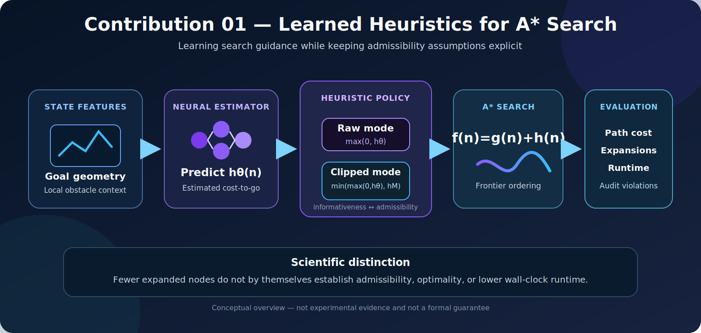

# Learned Heuristics for A* Search

[](.)
[](.)
[](.)

<p align="center">
  
</p>

<p align="center"><em>Conceptual overview of Contribution 01. The figure is explanatory and does not constitute experimental evidence, a proof of optimality, or a runtime guarantee.</em></p>

This contribution investigates **learning-augmented heuristic search** for grid-based navigation. The central question is whether a neural estimate of cost-to-go can reduce the number of states expanded by A* without obscuring the conditions under which classical optimality guarantees hold.

The implementation deliberately distinguishes between:

- a **raw learned heuristic**, which may improve search guidance but is not guaranteed to be admissible; and
- a **Manhattan-clipped learned heuristic**, which is admissible on the grid model considered here, but can be too conservative to improve over standard Manhattan A*.

The resulting module is intended as a transparent research prototype rather than as evidence that neural inference universally makes A* faster.

---

## Research question

> **Can a learned cost-to-go estimator reduce A* search effort while preserving solution quality under an explicitly stated admissibility policy?**

The study separates this question into three experimentally testable components:

1. **Search efficiency:** Does the heuristic reduce node expansions?
2. **Solution quality:** Does the returned path match the optimal path cost?
3. **Heuristic validity:** Does the heuristic satisfy admissibility and consistency?

---

## Problem formulation

Let a navigation problem be defined on a finite occupancy grid

\[
\mathcal{G}=(\mathcal{V},\mathcal{E}),
\]

where each free grid cell is a vertex, motion is restricted to the four cardinal directions, and every valid transition has unit cost. For a node \(n\), A* orders the frontier using

\[
f(n)=g(n)+h(n),
\]

where \(g(n)\) is the accumulated path cost and \(h(n)\) estimates the remaining cost to the goal.

For this motion model, the Manhattan heuristic

\[
h_{\mathrm{M}}(n)=|x_g-x_n|+|y_g-y_n|
\]

is admissible and consistent. It therefore provides the classical reference against which the learned heuristic is evaluated.

---

## Learned heuristic

A multilayer perceptron predicts the remaining path cost from an 11-dimensional feature representation containing relative goal geometry and local obstacle information. Denote the network prediction by

\[
h_\theta(n).
\]

Three heuristic modes are implemented.

| Mode | Definition | Interpretation |
|---|---:|---|
| `zero` | \(h(n)=0\) | Dijkstra-style optimal reference |
| `raw` | \(h(n)=\max(0,h_\theta(n))\) | Potentially informative, but not guaranteed admissible |
| `manhattan_clipped` | \(h(n)=\min(\max(0,h_\theta(n)),h_{\mathrm{M}}(n))\) | Admissible for the stated grid assumptions |

### Why clipping is admissible

Because Manhattan distance is admissible for four-neighbour unit-cost grids,

\[
h_{\mathrm{M}}(n)\leq h^*(n),
\]

where \(h^*(n)\) is the true optimal cost-to-go. Therefore,

\[
\min(h_\theta(n),h_{\mathrm{M}}(n))\leq h_{\mathrm{M}}(n)\leq h^*(n).
\]

This establishes admissibility of the clipped heuristic under the stated assumptions. It does **not** imply that the clipped estimate is more informative than Manhattan distance.

---

## Repository structure

```text
01_learned_astar/
├── README.md
├── README_GR.md
├── assets/
│   └── learned_astar_pipeline.svg      # Conceptual overview figure
├── code/
│   ├── learned_heuristic.py            # Neural-network definition
│   └── heuristic_logger.py             # Optional heuristic diagnostics
├── docs/
│   └── SCIENTIFIC_UPGRADE.md           # Scientific validation notes
├── experiments/
│   ├── astar_learned_heuristic.py      # A* implementation and heuristic modes
│   ├── eval_astar_learned.py           # Basic repeated evaluation
│   ├── statistical_validation.py       # Obstacle-density benchmark
│   └── admissibility_audit.py          # Admissibility and consistency audit
└── results/
    ├── c01_validation_trials.csv       # Per-trial measurements
    └── c01_validation_summary.csv      # Aggregated results
```

---

## Reproducibility

Run all commands from the repository root.

### Basic evaluation

```bash
python contributions/01_learned_astar/experiments/eval_astar_learned.py \
  --trials 100 \
  --out contributions/01_learned_astar/results/astar_eval_results.csv
```

### Statistical validation

```bash
python contributions/01_learned_astar/experiments/statistical_validation.py \
  --grid-size 40 \
  --trials-per-density 100 \
  --min-distance 20
```

### Admissibility and consistency audit

```bash
python contributions/01_learned_astar/experiments/admissibility_audit.py
```

The audit computes exact shortest-path cost-to-go values using reverse breadth-first search and reports sampled-state count, admissibility violations, overestimation magnitude, consistency violations, and the maximum consistency gap.

> **Important:** if the trained checkpoint is unavailable, the implementation may fall back to Manhattan guidance with a warning. Verify that the intended model checkpoint is loaded before interpreting a run as a learned-heuristic experiment.

---

## Evaluation protocol

The principal validation benchmark contains **400 navigation tasks** distributed across four obstacle-density regimes:

| Regime | Obstacle density | Trials |
|---|---:|---:|
| Easy | 10% | 100 |
| Medium | 20% | 100 |
| Hard | 30% | 100 |
| Very hard | 40% | 100 |

The following methods are evaluated on identical planning instances.

| Method | Heuristic | Formal status |
|---|---|---|
| `dijkstra_h0` | Zero | Optimal |
| `astar_manhattan` | Manhattan | Optimal |
| `learned_raw` | Raw neural estimate | Requires empirical path-cost validation |
| `learned_manhattan_clipped` | Neural estimate clipped by Manhattan | Admissible under the stated grid model |

Primary metrics are success rate, path cost, expanded nodes, and wall-clock runtime. Path cost and node expansions are reported separately because fewer expansions do not necessarily imply lower runtime when each expansion invokes a neural network.

---

## Results

All four methods achieved a **100% success rate** in the reported 400-task benchmark. Mean path costs were identical within each obstacle-density regime.

### Mean node expansions

| Environment | Manhattan A* | Raw learned A* | Manhattan-clipped learned A* |
|---|---:|---:|---:|
| Easy | 202.30 | **149.63** | 210.75 |
| Medium | 199.46 | **171.41** | 211.63 |
| Hard | 204.58 | **200.53** | 210.64 |
| Very hard | **240.99** | 244.04 | 247.02 |

Relative to Manhattan A*, the raw learned heuristic reduced mean expansions by approximately **26.0%** in easy environments, **14.1%** in medium environments, **2.0%** in hard environments, and provided no measurable reduction in very hard environments.

A separate 100-trial evaluation reported:

| Metric | Manhattan A* | Raw learned A* |
|---|---:|---:|
| Success rate | 100% | 100% |
| Path length | 42.21 ± 11.40 | 42.21 ± 11.40 |
| Node expansions | 461.23 ± 267.58 | 266.78 ± 212.18 |
| Runtime | 1.17 ± 0.68 ms | 18.31 ± 11.34 ms |

In that experiment, the learned heuristic reduced expansions by **42.8%**, but neural-network evaluation substantially increased wall-clock runtime.

---

## Interpretation

> A learned heuristic can reduce A* node expansions in relatively sparse grid environments, while its benefit decreases as obstacle density increases. Preserving admissibility through Manhattan clipping removes the formal risk of overestimation, but may also remove the learned heuristic's practical advantage.

The experiments demonstrate a trade-off among heuristic informativeness, admissibility, environmental complexity, and inference cost. The contribution should therefore be described as an improvement in **search guidance under selected conditions**, not as a general runtime acceleration of classical A*.

---

## Limitations

1. The admissibility argument applies only to four-neighbour, unit-cost grids.
2. Equal path costs on a finite benchmark do not prove admissibility or global optimality of the raw model.
3. Performance depends on the similarity between training and evaluation maps.
4. Per-node neural inference can dominate savings from fewer expansions.
5. Local hand-crafted features may not capture long-range obstacle topology.
6. Manhattan clipping is safe but cannot produce a heuristic larger than Manhattan.

---

## Research directions

Promising extensions include admissibility repair, conformal or quantile calibration of overestimation risk, uncertainty-aware heuristic weighting, cached or batched inference, graph-based encoders, evaluation under distribution shift, and explicit Pareto analysis of optimality, expansions, and runtime.

---

## Scientific claims

The evidence supports the claims that raw learned A* was empirically evaluated for expansion reduction and path-cost preservation, that it reduced expansions in easy and medium regimes, that Manhattan-clipped learned A* is admissible under the stated grid assumptions, and that fewer expansions did not translate into lower runtime in the reported CPU experiments.

The evidence does **not** establish that the raw heuristic is guaranteed admissible, that learned A* is universally optimal or faster, or that the reported behaviour generalizes beyond the evaluated map distribution.

---

## Role within DynNav

Contribution 01 establishes the learning-augmented planning baseline for DynNav. Subsequent contributions can incorporate calibrated uncertainty, learned risk maps, dynamic-obstacle predictions, or safety constraints into the planning objective.

---

## Citation

When using this module in academic work, cite the DynNav repository and report the exact commit, heuristic mode, checkpoint, map-generation parameters, and random seed used for evaluation.