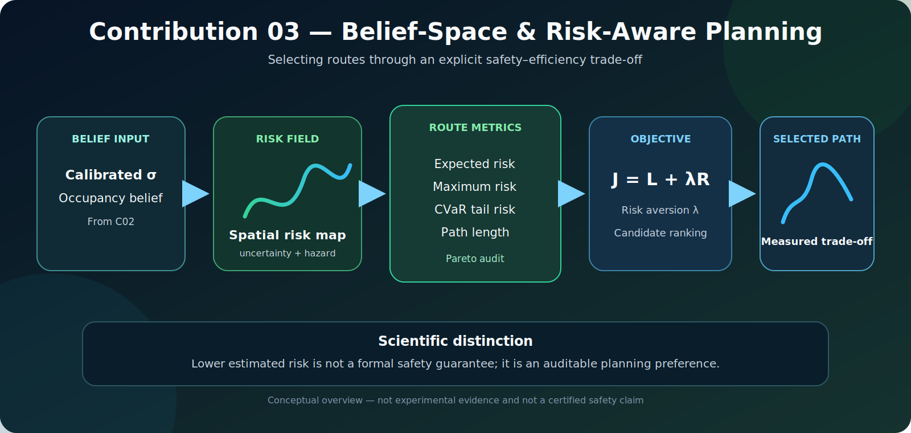

# Belief-Space and Risk-Aware Planning

[](.)
[](.)
[](.)

<p align="center">
  
</p>

<p align="center"><em>Conceptual overview of Contribution 03. The figure is explanatory and does not constitute experimental evidence or a formal safety guarantee.</em></p>

A geometrically shortest path is not necessarily the safest path. Contribution 03 studies navigation as an explicit **safety–efficiency trade-off**, combining path length with uncertainty-derived risk measures.

The module receives calibrated uncertainty from Contribution 02, constructs or consumes a spatial risk representation, evaluates candidate routes, and selects a route according to a declared risk preference.

---

## Research question

> **How should a robot plan when the shortest route and the lowest-risk route are different?**

The contribution evaluates:

1. expected path risk;
2. maximum path risk;
3. conditional value at risk (CVaR);
4. geometric path length;
5. scalarized risk–length objectives; and
6. Pareto dominance among candidate routes.

---

## Problem formulation

For a candidate path \(\pi\), a basic scalar objective is

\[
J(\pi)=L(\pi)+\lambda R(\pi),
\]

where \(L(\pi)\) is geometric path cost, \(R(\pi)\) is a selected risk functional, and \(\lambda\geq0\) controls risk aversion.

- \(\lambda=0\) yields risk-neutral geometric planning.
- Larger \(\lambda\) allows the planner to accept a longer path in exchange for reduced risk exposure.

A scalar objective is useful but incomplete: different values of \(\lambda\) encode different preferences, and one scalarization may hide dominated solutions. The implementation therefore also reports Pareto relationships.

---

## Risk metrics

| Metric | Interpretation |
|---|---|
| Expected risk | Mean or accumulated risk along the route |
| Maximum risk | Worst individual risk value encountered |
| CVaR | Mean of the worst tail of route-risk values |
| Path-length increase | Additional geometric cost paid for lower risk |
| Pareto dominance | Whether another route is no worse in both length and risk and strictly better in at least one |

CVaR is particularly relevant when a short route contains a small but severe high-risk segment that may be diluted by an average-risk metric.

---

## Repository structure

```text
03_belief_risk_planning/
├── README.md
├── README_GR.md
├── assets/
│   └── belief_risk_planning_pipeline.svg
├── code/
│   └── risk_tradeoff_analyzer.py
├── docs/
│   └── SCIENTIFIC_UPGRADE.md
├── experiments/
│   ├── lambda_sweep_risk_length_demo.py
│   └── eval_risk_tradeoff.py
└── results/
    ├── lambda_sweep_risk_length_results.csv
    └── c03_risk_tradeoff_benchmark.csv
```

---

## Reproducibility

Run from the repository root:

```bash
python contributions/03_belief_risk_planning/experiments/lambda_sweep_risk_length_demo.py
```

```bash
python contributions/03_belief_risk_planning/experiments/eval_risk_tradeoff.py
```

The benchmark writes:

```text
contributions/03_belief_risk_planning/results/c03_risk_tradeoff_benchmark.csv
```

Reportable experiments should preserve the exact commit, risk-map source, uncertainty calibration method, candidate routes, risk metric, \(\lambda\), random seed, and map-generation parameters.

---

## Reported results

The original lambda-sweep experiment reported:

| Metric | Value |
|---|---:|
| Lambda values tested | 6 |
| Success rate | 100% |
| Baseline risk at \(\lambda=0\) | 0.400 |
| Best risk at \(\lambda=0.1\) | 0.229 |
| Relative risk reduction | 42.75% |
| Path-length increase | 0.00% |

Under the evaluated scenario, risk-aware planning reduced the fused path-risk score while preserving geometric path length. This is an empirical result for that benchmark, not evidence that risk reduction is cost-free across arbitrary maps or risk models.

The upgraded benchmark additionally reports expected risk, maximum risk, CVaR, total scalar objective, relative risk reduction, path-length increase, and Pareto dominance.

---

## Interpretation

> Contribution 03 demonstrates how route selection can be audited as a measurable trade-off among geometric efficiency, average risk, tail risk, and worst-case exposure.

The scientific contribution is not merely “adding risk to A*.” It is the explicit separation of multiple risk notions and the evaluation of whether a selected route is genuinely competitive or only preferred because of a chosen scalar weight.

Lower estimated risk does **not** imply formal safety. The result depends on the quality and calibration of the upstream uncertainty and risk model.

---

## Limitations

1. The value of \(\lambda\) is manually selected.
2. A scalar objective cannot represent every safety preference.
3. The planner inherits errors and distribution shift from Contribution 02.
4. Synthetic benchmarks do not establish real-world safety.
5. Risk scores are planning signals, not certified constraints.
6. Formal safety enforcement remains outside this contribution.

---

## Research directions

The strongest next step is adaptive risk aversion. The planner should increase \(\lambda\) when calibrated uncertainty rises, recoverability decreases, safety margins shrink, or safe mode is activated. Other directions include distributionally robust risk, dynamic risk maps, multi-objective search, constrained optimization, and statistical validation across multiple seeds and map families.

---

## Role within DynNav

- **Receives:** calibrated uncertainty from Contribution 02.
- **Complements:** returnability and recoverability reasoning in Contribution 04.
- **Supports:** safe-mode policies in Contribution 05.
- **Can be extended by:** dynamic risk maps and formal safety shields.

Recommended interface:

```text
planner_input = {
    map,
    start,
    goal,
    calibrated_uncertainty,
    risk_metric,
    lambda_value,
    safety_constraints
}
```

---

## Scientific claims

The current evidence supports the claim that the evaluated risk-aware objective reduced the reported route-risk score without increasing path length in the original benchmark. It does not establish that the method is universally safer, that the chosen risk score is perfectly calibrated, or that similar improvements generalize to unseen environments.

---

## Citation

Academic use should report the repository commit, experiment command, risk metric, \(\lambda\), calibration method, data provenance, map parameters, and random seed.