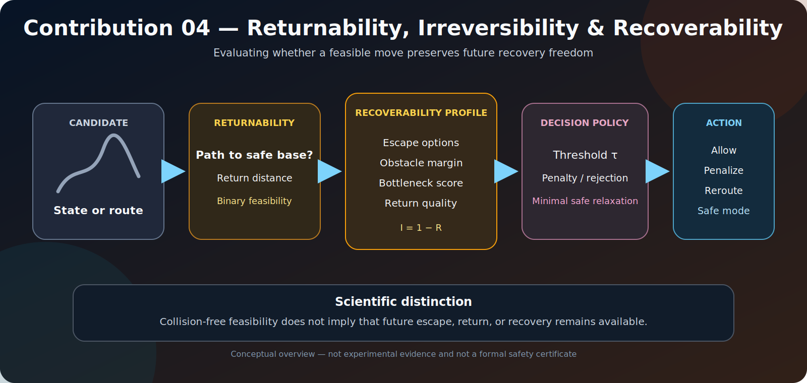

# Irreversibility, Returnability, and Recoverability

[](.)
[](.)
[](.)

<p align="center">
  
</p>

<p align="center"><em>Conceptual overview of Contribution 04. The figure is explanatory and does not constitute experimental evidence or a formal safety certificate.</em></p>

A path can be collision-free and immediately feasible while still reducing the robot's ability to escape, return, or recover later. Contribution 04 introduces planning signals that evaluate **future recovery freedom before commitment**.

The module distinguishes binary returnability from continuous recoverability and interprets irreversibility as the progressive loss of future recovery options.

---

## Research question

> **How can a navigation system avoid or manage irreversible decisions while preserving planning feasibility?**

The contribution studies:

1. returnability to a trusted base or safe region;
2. recoverability as retained future decision freedom;
3. irreversibility as loss of that freedom;
4. bottlenecks and cul-de-sac commitments;
5. threshold-based acceptance or rejection; and
6. minimal safe-mode relaxation when strict constraints become infeasible.

---

## Core concepts

| Concept | Interpretation |
|---|---|
| Returnability | Whether a trusted base or safe region remains reachable |
| Recoverability | How much future recovery freedom remains |
| Irreversibility | Proximity to losing recovery freedom |
| Bottleneck score | Degree of local spatial constraint |
| Escape options | Number of locally available safe transitions |
| Threshold \(\tau\) | Maximum permitted irreversibility before rejection or relaxation |

Returnability is binary. Recoverability is continuous and allows two technically returnable states to be ranked according to how fragile they are.

---

## Operational formulation

For a candidate state \(x\), the implementation combines interpretable signals such as:

- shortest return distance to a trusted base;
- local escape-option count;
- local obstacle density or clearance;
- bottleneck structure; and
- route-level minimum recoverability.

A normalized score may be interpreted as

\[
R_{\mathrm{rec}}(x)\in[0,1],
\]

with the corresponding irreversibility score

\[
I(x)=1-R_{\mathrm{rec}}(x).
\]

A threshold policy may reject a state when

\[
I(x)>\tau.
\]

When no feasible route satisfies a strict threshold, safe mode may increase \(\tau\) only as much as necessary to restore feasibility. This is a pragmatic relaxation mechanism, not a formal proof of safety.

---

## Repository structure

```text
04_irreversibility_returnability/
├── README.md
├── README_GR.md
├── assets/
│   └── recoverability_pipeline.svg
├── code/
│   └── recoverability_metrics.py
├── docs/
│   └── SCIENTIFIC_UPGRADE.md
├── experiments/
│   └── eval_recoverability_metrics.py
└── results/
    └── c04_recoverability_metrics.csv
```

---

## Reproducibility

Run from the repository root:

```bash
python contributions/04_irreversibility_returnability/experiments/eval_recoverability_metrics.py
```

The benchmark writes:

```text
contributions/04_irreversibility_returnability/results/c04_recoverability_metrics.csv
```

It evaluates routes through open areas, bottlenecks, cul-de-sac-like commitments, and recovery-preserving alternatives.

Reportable experiments should preserve the commit, map, trusted-base definition, threshold policy, normalization parameters, random seed, and any safe-mode relaxation rule.

---

## Reported results

The original threshold-sweep experiment reported:

| Metric | Value |
|---|---:|
| Hard-threshold success rate | 26.7% |
| Minimum feasible \(\tau\) | 0.85 |
| Safe-mode success rate | 100% |
| Safe-mode relaxed cases | 15 / 26 |
| Mean \(\tau\) relaxation gap | 0.080 |
| Safe-mode path length | 45 |
| Mean irreversibility on path | 0.480 |
| Maximum irreversibility on path | 0.850 |
| Returnability sweep success rate | 100% |

The strict threshold frequently removed all feasible paths. Safe mode restored feasibility by relaxing \(\tau\) only as much as required in the evaluated cases. The reported mean relaxation gap was small, but this does not establish optimality or safety of the relaxation policy in general.

The upgraded benchmark additionally computes binary returnability, return distance, escape options, bottleneck score, local obstacle density, normalized recoverability, irreversibility, path-level minimum recoverability, and path-level maximum irreversibility.

---

## Interpretation

> Contribution 04 evaluates not only whether a move is currently possible, but whether it preserves sufficient future recovery freedom.

This distinction matters because two states may both remain geometrically connected to a base while differing substantially in bottleneck exposure, local escape options, and sensitivity to uncertainty.

The module therefore provides an auditable planning signal for fragile commitments. It does **not** provide a certified safety barrier or a complete kinodynamic notion of recoverability.

---

## Limitations

1. The current score is interpretable but heuristic.
2. The environment is represented as a grid.
3. Returnability is primarily geometric and omits full robot dynamics.
4. Escape-option counts omit orientation, velocity, and actuator constraints.
5. A geometrically returnable state may be unsafe under localization drift or dynamic obstacles.
6. Safe-mode threshold relaxation can restore feasibility but may increase exposure.
7. Formal safety enforcement remains outside this contribution.

---

## Research directions

The strongest extension is dynamic recoverability:

\[
R(x_t),\qquad \frac{dR}{dt}.
\]

The planner should react not only when recoverability is low, but also when it is decreasing rapidly. Further directions include kinodynamic returnability, uncertainty-conditioned reachability, learned recovery models, temporal bottleneck prediction, and constrained optimization with hard viability sets.

---

## Role within DynNav

- **Receives:** calibrated uncertainty from Contribution 02.
- **Complements:** risk-aware planning in Contribution 03.
- **Supports:** safe-mode logic in Contribution 05.
- **Can inform:** returnability-aware exploration and world-model rollouts.
- **Requires separate enforcement for:** formal safety constraints.

Recommended interface:

```text
planner_input = {
    map,
    candidate_state,
    trusted_base,
    calibrated_uncertainty,
    recoverability_threshold,
    irreversibility_threshold
}
```

---

## Scientific claims

The current evidence supports the claim that recoverability-related metrics can distinguish route types and that threshold relaxation restored feasibility in the reported benchmark. It does not establish formal safety, universal threshold validity, kinodynamic returnability, or generalization to arbitrary environments.

---

## Citation

Academic use should report the repository commit, experiment command, trusted-base definition, recoverability formula, threshold policy, relaxation rule, map parameters, and random seed.