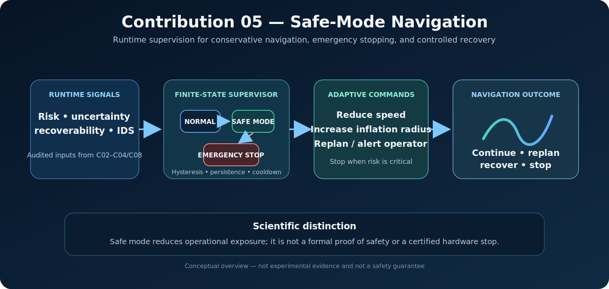

# Safe-Mode Navigation

[](.)
[](.)
[](.)

[Ελληνική έκδοση](README_GR.md)

<p align="center">
  
</p>

<p align="center"><em>Conceptual overview. The figure is not experimental evidence, a formal safety proof, or a certified emergency-stop implementation.</em></p>

## Overview

Contribution 05 implements an auditable runtime supervisor that adapts navigation behaviour when risk becomes elevated or critical. The controller does not replace the planner. It changes operational commands—speed, obstacle inflation, replanning, operator alerts, and stopping—according to an explicit finite-state policy.

The implementation distinguishes three states:

- `NORMAL`: nominal navigation parameters;
- `SAFE_MODE`: conservative navigation with reduced speed and increased obstacle margin;
- `EMERGENCY_STOP`: zero commanded speed and operator alert.

The module is a research prototype for degraded-operation supervision. It must not be interpreted as a certified hardware safety controller.

---

## Research question

> **How should an autonomous robot modify its navigation behaviour when risk, uncertainty, or loss of recoverability makes nominal operation inappropriate?**

The study focuses on:

1. reliable mode activation and recovery;
2. suppression of rapid state oscillation;
3. conservative command generation;
4. emergency-stop escalation;
5. the trade-off between risk exposure and navigation efficiency.

---

## Controller formulation

Let \(r_t\) denote the runtime risk signal at time step \(t\). The supervisor uses three thresholds and temporal conditions:

- activation threshold \(r_{\mathrm{on}}\);
- recovery threshold \(r_{\mathrm{off}} < r_{\mathrm{on}}\);
- critical threshold \(r_{\mathrm{crit}} \ge r_{\mathrm{on}}\).

The principal transitions are:

```text
NORMAL -> SAFE_MODE
    risk >= risk_on_threshold for activation_steps_required steps

SAFE_MODE -> NORMAL
    risk <= risk_off_threshold for recovery_steps_required steps

ANY STATE -> EMERGENCY_STOP
    risk >= critical_threshold

EMERGENCY_STOP -> SAFE_MODE
    risk <= risk_off_threshold for recovery_steps_required steps
```

The separation between `risk_on_threshold` and `risk_off_threshold` creates hysteresis. Activation persistence, recovery persistence, and cooldown further reduce mode chattering near decision boundaries.

---

## Runtime outputs

For every update, the controller returns:

| Output | Meaning |
|---|---|
| `state` | Current supervisory state |
| `speed_scale` | Nominal, reduced, or zero commanded speed |
| `inflation_radius` | Obstacle-margin parameter associated with the state |
| `should_replan` | Whether the state transition requests replanning |
| `alert_operator` | Whether escalation requires operator notification |
| `emergency_stop` | Whether the controller is in the simulated stop state |
| `transition` | Logged state transition |

The current default configuration is defined in `SafeModeConfig` and should be reported explicitly in reproducible experiments.

---

## Repository structure

```text
05_safe_mode_navigation/
├── README.md
├── README_GR.md
├── assets/
│   └── safe_mode_navigation_pipeline.svg
├── code/
│   └── safe_mode_controller.py
├── docs/
│   └── SCIENTIFIC_UPGRADE.md
├── experiments/
│   └── eval_safe_mode_thresholds.py
└── results/
    └── c05_safe_mode_thresholds.csv
```

---

## Reproducibility

Run from the repository root:

```bash
python contributions/05_safe_mode_navigation/experiments/eval_safe_mode_thresholds.py
```

The benchmark writes:

```text
contributions/05_safe_mode_navigation/results/c05_safe_mode_thresholds.csv
```

The evaluation includes synthetic traces representing nominal noise, temporary hazards, critical spikes, and risk values that fluctuate near the switching threshold.

---

## Reported experiment

A reported ablation compares a normal policy with safe-mode behaviour.

| Metric | Normal policy | Safe mode |
|---|---:|---:|
| Total distance | 1.1 | 4.0 |
| Total risk | 1.2 | 0.4 |
| Maximum risk | 0.9 | 0.2 |
| Total cost | 4.9 | 10.4 |

Corresponding relative changes were:

| Metric | Change |
|---|---:|
| Accumulated-risk reduction | 66.7% |
| Maximum-risk reduction | 77.8% |
| Distance increase | 263.6% |
| Total-cost increase | 112.2% |

These values support a limited conclusion: the evaluated safe-mode policy reduced accumulated and peak risk, but paid a substantial efficiency cost. Safe mode is therefore a configurable risk–efficiency trade-off rather than a free performance improvement.

---

## Scientific interpretation

The contribution is stronger than a single threshold rule because it implements an explicit finite-state supervisor with:

- hysteresis;
- activation and recovery persistence;
- post-recovery cooldown;
- emergency escalation;
- transition logging; and
- trace-level summary metrics.

This makes switching behaviour measurable and auditable. It does not establish formal safety, because the risk signal, thresholds, plant dynamics, low-level controller, and stopping hardware are not jointly verified.

---

## Integration within DynNav

The supervisor can consume:

```text
safe_mode_input = {
    calibrated_uncertainty,
    path_risk,
    recoverability_score,
    ids_alert,
    mission_context
}
```

It is designed to connect:

- calibrated uncertainty from C02;
- risk-aware planning from C03;
- recoverability and irreversibility from C04;
- cyber-physical alerts from C08; and
- formal safety constraints from C18.

---

## Limitations

1. The benchmark uses synthetic risk traces for controlled evaluation.
2. Thresholds are hand-selected and may not generalize across robots or environments.
3. `EMERGENCY_STOP` is a software state, not a certified hardware stop.
4. The implementation does not model braking distance, actuator latency, or robot dynamics.
5. Reduced risk exposure does not constitute a mathematical safety guarantee.
6. Deployment requires integration with validated planners, low-level controllers, hardware interlocks, and applicable safety standards.

---

## Research directions

A natural extension is adaptive thresholding:

\[
r_{\mathrm{on},t}=f(\sigma_t^{\mathrm{cal}},R_t,\rho_t,a_t,m_t),
\]

where calibrated uncertainty, path risk, recoverability, alert state, and mission context jointly determine supervisory sensitivity. Further work should evaluate threshold robustness, transition delay, false activations, missed activations, stopping distance, and closed-loop mission outcomes.

---

## Supported claims

The available implementation and reported benchmark support the following statements:

- C05 implements a three-state runtime supervisor with hysteresis and temporal persistence.
- The evaluated safe-mode policy reduced risk exposure while increasing distance and total cost.
- State transitions and controller outputs can be logged and summarized reproducibly.

They do not support unrestricted claims that the controller guarantees collision avoidance, implements a certified emergency stop, or is safe for deployment without independent validation.

---

## Citation and reporting

Academic use should report the repository commit, controller configuration, risk-trace source, random seed, evaluation command, and hardware or simulation context. These details are necessary to distinguish software supervision results from formal or physical safety evidence.
