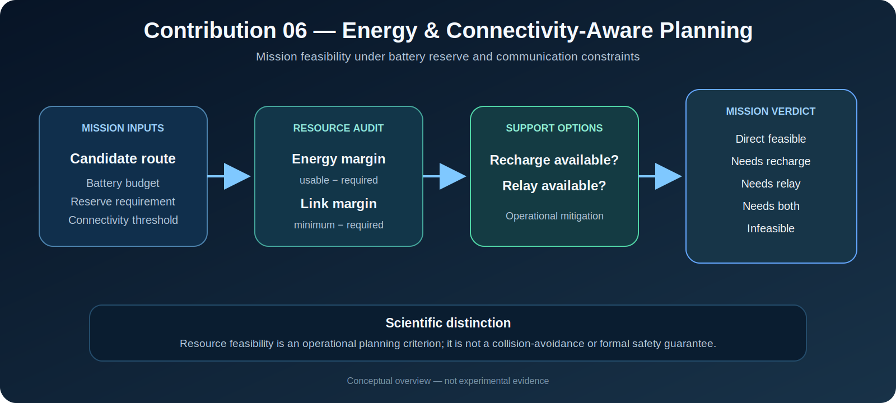

# Σχεδιασμός με Επίγνωση Ενέργειας και Συνδεσιμότητας

[](.)
[](.)
[](.)

[English](README.md) | **Ελληνικά**

<p align="center">
  
</p>

<p align="center"><em>Εννοιολογική απεικόνιση. Η εικόνα δεν αποτελεί πειραματική απόδειξη, εγγύηση αποφυγής συγκρούσεων ή πιστοποίηση ασφάλειας αποστολής.</em></p>

Η συνεισφορά αυτή μελετά την πλοήγηση υπό δύο επιχειρησιακούς περιορισμούς που συνήθως απουσιάζουν από έναν καθαρά γεωμετρικό planner: την **πεπερασμένη διαθέσιμη ενέργεια** και την **περιορισμένη ποιότητα επικοινωνίας**. Οι υποψήφιες διαδρομές αξιολογούνται μέσω ρητών περιθωρίων πόρων και λαμβάνουν ελέγξιμη απόφαση εφικτότητας.

---

## Ερευνητικό ερώτημα

> **Πώς πρέπει να ταξινομεί και να επιλέγει διαδρομές ένα σύστημα πλοήγησης όταν το ενεργειακό απόθεμα και η ποιότητα επικοινωνίας καθορίζουν την εφικτότητα της αποστολής;**

Η μελέτη διαχωρίζει τρία ερωτήματα:

1. Είναι η διαδρομή εφικτή με τη διαθέσιμη αξιοποιήσιμη ενέργεια;
2. Διατηρείται η απαιτούμενη ελάχιστη ποιότητα επικοινωνίας;
3. Μπορεί η επαναφόρτιση ή ένας κόμβος αναμετάδοσης να αποκαταστήσει μια διαφορετικά μη εφικτή διαδρομή;

---

## Μαθηματική διατύπωση

Για υποψήφια διαδρομή \(\pi\), η απαιτούμενη ενέργεια εκτιμάται ως

\[
E_{\mathrm{req}}(\pi)=d(\pi)c_E,
\]

όπου \(d(\pi)\) είναι το μήκος της διαδρομής και \(c_E\) το ενεργειακό κόστος ανά μέτρο. Η αξιοποιήσιμη ενέργεια είναι

\[
E_{\mathrm{use}}=\max(0,E_{\mathrm{battery}}-E_{\mathrm{reserve}}),
\]

και το ενεργειακό περιθώριο

\[
m_E=E_{\mathrm{use}}-E_{\mathrm{req}}.
\]

Για ελάχιστη ποιότητα σύνδεσης \(q_{\min}(\pi)\) και απαιτούμενο κατώφλι \(q_{\mathrm{req}}\), το περιθώριο συνδεσιμότητας είναι

\[
m_Q=q_{\min}(\pi)-q_{\mathrm{req}}.
\]

Μια άμεση διαδρομή είναι εφικτή όταν \(m_E\geq0\) και \(m_Q\geq0\). Οι ενδείξεις recharge και relay αναπαριστούν απλοποιημένους μηχανισμούς υποστήριξης.

---

## Υλοποιημένες αποφάσεις αποστολής

| Απόφαση | Ερμηνεία |
|---|---|
| `DIRECT_FEASIBLE` | Οι ενεργειακοί και επικοινωνιακοί περιορισμοί ικανοποιούνται άμεσα |
| `NEEDS_RECHARGE` | Απαιτείται υποστήριξη επαναφόρτισης |
| `NEEDS_RELAY` | Απαιτείται επικοινωνιακό relay |
| `NEEDS_RECHARGE_AND_RELAY` | Απαιτούνται και οι δύο μηχανισμοί |
| `INFEASIBLE` | Οι διαθέσιμες παρεμβάσεις δεν αποκαθιστούν όλους τους περιορισμούς |

Η επιλογή προτιμά πρώτα διαδρομές με λιγότερες απαιτήσεις υποστήριξης, έπειτα μικρότερο μήκος και τέλος μεγαλύτερα περιθώρια πόρων.

---

## Δομή φακέλου

```text
06_energy_connectivity/
├── README.md
├── README_GR.md
├── assets/
│   └── energy_connectivity_pipeline.svg
├── code/
│   └── resource_feasibility.py
├── docs/
│   └── SCIENTIFIC_UPGRADE.md
├── experiments/
│   ├── eval_energy_connectivity.py
│   └── eval_resource_feasibility.py
└── results/
    ├── c06_energy_connectivity_summary.csv
    ├── c06_energy_connectivity_summary.md
    └── c06_resource_feasibility.csv
```

---

## Αναπαραγωγιμότητα

Οι εντολές εκτελούνται από τη ρίζα του repository.

```bash
python contributions/06_energy_connectivity/experiments/eval_energy_connectivity.py
python contributions/06_energy_connectivity/experiments/eval_resource_feasibility.py
```

Το δεύτερο benchmark παράγει:

```text
contributions/06_energy_connectivity/results/c06_resource_feasibility.csv
```

Για επιστημονικά αναφέρσιμη εκτέλεση πρέπει να καταγράφονται το commit, οι ορισμοί των διαδρομών, οι παράμετροι, τα κατώφλια και ο random seed όπου εφαρμόζεται.

---

## Πρωτόκολλο αξιολόγησης

Το benchmark περιλαμβάνει αντιπροσωπευτικές περιπτώσεις: σύντομη διαδρομή με ασθενή σύνδεση, μακρύτερη διαδρομή με καλύτερη συνδεσιμότητα, διαδρομή μέσω φορτιστή, διαδρομή μέσω relay, διαδρομή που απαιτεί και τα δύο, και μη επιδιορθώσιμη διαδρομή.

Οι βασικές έξοδοι είναι η απαιτούμενη και αξιοποιήσιμη ενέργεια, τα ενεργειακά και επικοινωνιακά περιθώρια, οι μηχανισμοί υποστήριξης, η εφικτότητα και η τελική απόφαση αποστολής.

---

## Ερμηνεία

Το C06 είναι ένα **επίπεδο επιχειρησιακής εφικτότητας πόρων**. Επιτρέπει στο planner ή στον supervisor να διακρίνει την άμεση εκτέλεση, την εκτέλεση με υποστήριξη και την απόρριψη αποστολής.

Δεν αποδεικνύει ότι η διαδρομή είναι χωρίς συγκρούσεις, δυναμικά εφικτή, κυβερνοασφαλής ή τυπικά ασφαλής.

---

## Περιορισμοί

1. Η ενέργεια μοντελοποιείται ως απόσταση επί σταθερό συντελεστή.
2. Δεν περιλαμβάνονται έδαφος, φορτίο, επιτάχυνση, στροφές, sensing, υπολογισμός και δυναμική μπαταρίας.
3. Η συνδεσιμότητα συνοψίζεται σε τιμές διαδρομής και όχι σε συμπεριφορά δικτύου ανά πακέτο.
4. Recharge και relay είναι Boolean γνωρίσματα και όχι αποφάσεις scheduling.
5. Δεν μοντελοποιούνται latency, packet loss, ROS 2 QoS, παρεμβολές και multi-hop topology.
6. Η εφικτότητα πόρων δεν αντικαθιστά την αποφυγή συγκρούσεων ή την τυπική επαλήθευση ασφάλειας.

---

## Ερευνητικές κατευθύνσεις

Μελλοντικές επεκτάσεις περιλαμβάνουν ενεργειακά μοντέλα εξαρτώμενα από ταχύτητα και έδαφος, πιθανοτικά πεδία συνδεσιμότητας, ανάθεση relay, προγραμματισμό φόρτισης, κοινή βελτιστοποίηση πόρων και κινδύνου και online επανασχεδιασμό πριν τα περιθώρια γίνουν αρνητικά.

Μια ισχυρότερη μελλοντική αντικειμενική συνάρτηση θα μπορούσε να είναι

\[
J(\pi)=w_L L(\pi)+w_E E(\pi)+w_Q Q_{\mathrm{loss}}(\pi)
\]

με ρητούς περιορισμούς ενεργειακού αποθέματος και ποιότητας σύνδεσης.

---

## Επιστημονικοί ισχυρισμοί

Η υλοποίηση υποστηρίζει ότι:

- υπολογίζονται ρητά ενεργειακά και επικοινωνιακά περιθώρια,
- οι διαδρομές λαμβάνουν ελέγξιμες αποφάσεις εφικτότητας,
- μπορούν να αναπαρασταθούν απλοποιημένοι μηχανισμοί recharge και relay,
- οι εφικτές διαδρομές μπορούν να ταξινομηθούν βάσει υποστήριξης, μήκους και περιθωρίων.

Δεν υποστηρίζει ισχυρισμούς ρεαλιστικής πρόβλεψης μπαταρίας, εγγυημένης διαθεσιμότητας δικτύου, βέλτιστου scheduling ή πιστοποιημένης ασφάλειας αποστολής.

---

## Ρόλος στο DynNav

Το C06 τροφοδοτεί τον risk-aware planning, το safe-mode supervision, τον multi-robot συντονισμό μέσω relay και την ενεργή εξερεύνηση με ρητούς περιορισμούς πόρων.

---

## Αναφορά και αναπαραγωγιμότητα

Σε ακαδημαϊκή χρήση πρέπει να αναφέρονται το ακριβές commit, οι διαδρομές, το battery budget, το reserve, ο ενεργειακός συντελεστής, το κατώφλι συνδεσιμότητας, οι διαθέσιμοι μηχανισμοί υποστήριξης και η εντολή benchmark.