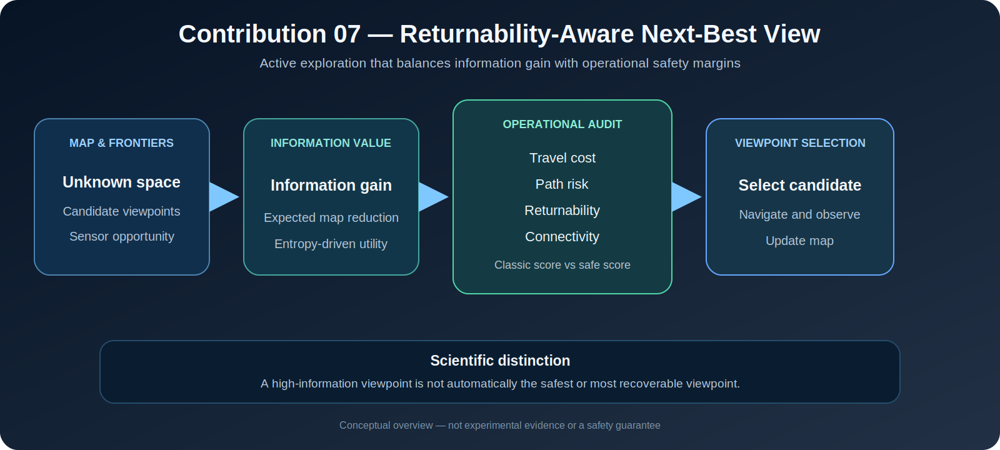

# Returnability-Aware Next-Best-View Exploration

[](.)
[](.)
[](.)

**English** | [Ελληνικά](README_GR.md)

<p align="center">
  
</p>

<p align="center"><em>Conceptual overview. The figure is not experimental evidence, a formal exploration-optimality result, or a safety guarantee.</em></p>

This contribution studies **active exploration** in unknown environments. It extends classical next-best-view selection beyond information gain and travel cost by explicitly accounting for path risk, returnability, and connectivity.

The central premise is that an informative viewpoint is not necessarily an operationally acceptable viewpoint.

---

## Research question

> **How can a robot select informative viewpoints while preserving recovery freedom, limiting risk exposure, and maintaining communication quality?**

The contribution evaluates whether candidate viewpoints should be preferred based on:

1. expected information gain;
2. travel cost;
3. path risk;
4. returnability; and
5. communication quality.

---

## Problem formulation

For candidate viewpoint \(v\), the classical score is

\[
S_{\mathrm{classic}}(v)=\frac{I(v)}{\max(C(v),\epsilon)},
\]

where \(I(v)\) is information gain and \(C(v)\) is travel cost.

The implemented safety-aware score is

\[
S_{\mathrm{safe}}(v)=
\frac{I(v)\left(1+w_R R(v)\right)\left(1+w_Q Q(v)\right)}
{\max(C(v),\epsilon)\left(1+w_P P(v)\right)},
\]

where:

- \(R(v)\in[0,1]\) is returnability;
- \(Q(v)\in[0,1]\) is connectivity;
- \(P(v)\geq0\) is path risk;
- \(w_R,w_Q,w_P\) are configurable weights.

The implementation reports both scores and records whether each candidate is selected by the classical or safety-aware policy.

---

## Interpretation of the scoring rule

The safety-aware score rewards:

- high expected information gain;
- strong returnability; and
- preserved connectivity.

It penalizes:

- long travel cost; and
- high route risk.

This is a transparent scalarization of competing objectives. It is not a proof that the selected viewpoint is globally optimal or formally safe.

---

## Repository structure

```text
07_next_best_view/
├── README.md
├── README_GR.md
├── assets/
│   └── next_best_view_pipeline.svg
├── code/
│   └── nbv_scoring.py
├── docs/
│   └── SCIENTIFIC_UPGRADE.md
├── experiments/
│   └── eval_returnability_aware_nbv.py
└── results/
    └── c07_returnability_aware_nbv.csv
```

---

## Reproducibility

Run the benchmark from the repository root:

```bash
python contributions/07_next_best_view/experiments/eval_returnability_aware_nbv.py
```

The command writes:

```text
contributions/07_next_best_view/results/c07_returnability_aware_nbv.csv
```

A reportable experiment should preserve the exact commit, candidate definitions, scoring weights, map assumptions, and random seed where applicable.

---

## Evaluation protocol

The benchmark compares synthetic viewpoint candidates representing distinct exploration trade-offs, including:

- a nearby low-information viewpoint;
- a distant high-information viewpoint;
- a bottleneck frontier;
- a balanced low-risk and returnable frontier; and
- a relay-supported frontier.

For each candidate, the benchmark records information gain, travel cost, path risk, returnability, connectivity, classical score, safety-aware score, and policy selections.

The benchmark is intended for auditability of the scoring logic. It is not equivalent to closed-loop exploration with real sensor observations.

---

## Scientific contribution

C07 reframes next-best-view selection as an **information–risk–recoverability trade-off** rather than a purely entropy-driven objective.

The contribution is stronger than choosing the largest information-gain-to-cost ratio because it asks whether the robot can safely exploit the acquired information and preserve future decision freedom after reaching the viewpoint.

---

## Limitations

1. Candidate viewpoints and their attributes are synthetically specified in the current benchmark.
2. Information gain is not computed from a full probabilistic sensor and occlusion model.
3. The score weights are manually selected.
4. Returnability and path risk depend on upstream approximations.
5. Connectivity is represented as a scalar candidate attribute.
6. The benchmark does not implement repeated sensing, map update, frontier regeneration, and closed-loop replanning.
7. A high safety-aware score does not constitute a formal safety guarantee.

---

## Research directions

Relevant extensions include:

- map-derived frontier generation;
- entropy reduction from realistic sensor models;
- occlusion and field-of-view reasoning;
- adaptive or learned scoring weights;
- Pareto-front viewpoint selection;
- uncertainty-aware returnability estimation;
- connectivity prediction along the full route; and
- closed-loop exploration under dynamic obstacles and distribution shift.

A future system should adapt exploration aggressiveness to mission phase, resource margins, uncertainty, and safe-mode state.

---

## Scientific claims

The implementation supports the following limited claims:

- classical and returnability-aware NBV scores are computed explicitly;
- risk, returnability, and connectivity can change viewpoint ranking relative to the classical information-gain policy;
- viewpoint selection decisions are auditable through per-candidate metrics; and
- the benchmark exposes the operational trade-offs encoded by the chosen weights.

It does **not** establish globally optimal exploration, guaranteed map-completion efficiency, realistic sensor performance, or certified navigation safety.

---

## Role within DynNav

C07 consumes uncertainty and map information, route risk from C03, recoverability from C04, and connectivity from C06. It can also trigger C05 safe-mode behavior when all informative candidates have weak operational margins.

---

## Citation and reproducibility

When using this module academically, report the exact commit, candidate set, scoring weights, definitions of information gain, risk, returnability and connectivity, benchmark command, and random seed.