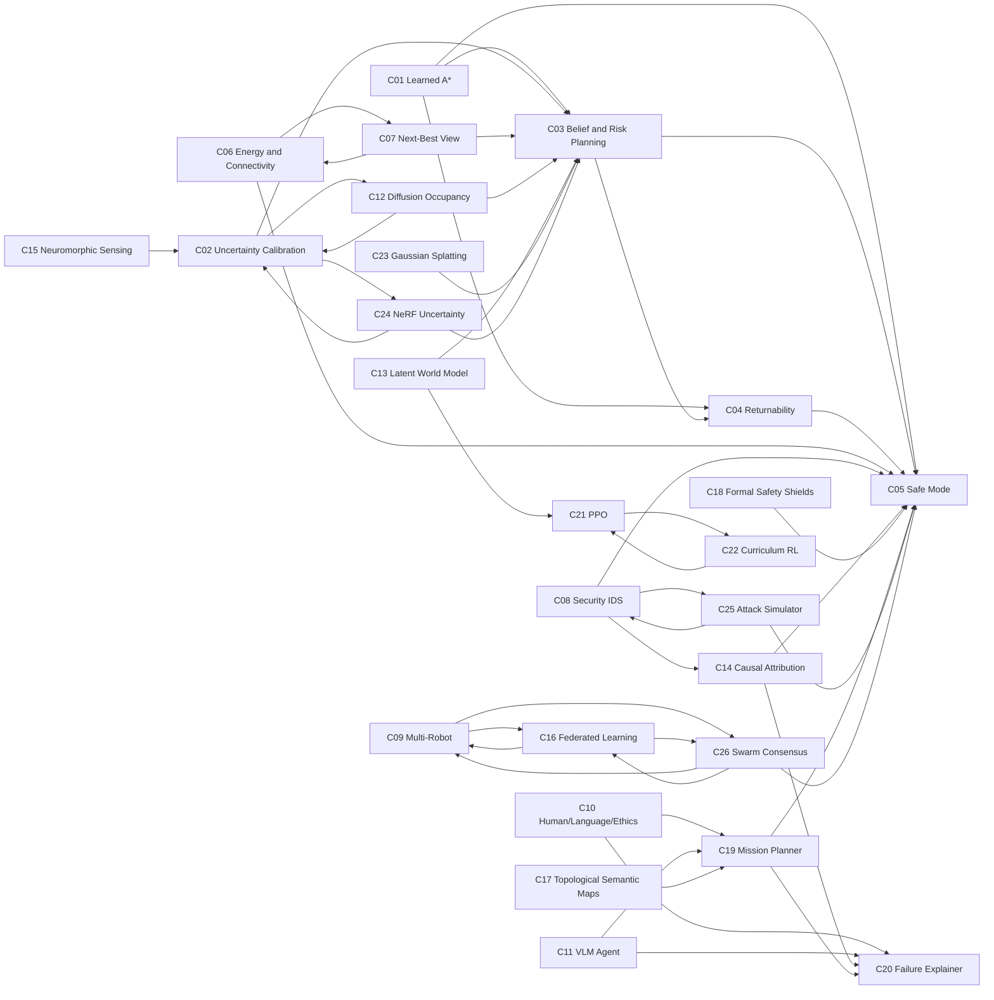

# DynNav Contribution Dependency Graph

> Generated explanatory architecture — not experimental evidence.
>
> Relationships come from `configs/contributions/registry.yaml` and represent intended integration boundaries.

## Integration clusters

### Search, risk, recoverability, and supervision

C01 supplies learned search behavior; C02 calibrates uncertainty; C03 incorporates belief and risk; C04 evaluates reversibility; C05 owns runtime supervisory responses.

### Resource-aware active perception

C06 provides battery/connectivity feasibility and C07 combines it with information gain, travel cost, and risk-aware viewpoint selection.

### Security and explanation

C25 generates reproducible attacks, C08 detects and fuses trust signals, C14 structures attribution under explicit assumptions, and C20 produces evidence-grounded explanations. C05 remains the mitigation boundary.

### Multi-robot learning and consensus

C09 provides coordination scenarios, C16 studies distributed model updates, and C26 studies consensus under a bounded Byzantine threat model.

### Language and multimodal planning

C10 and C11 provide human-, language-, and perception-facing inputs. C19 translates accepted instructions into schema-constrained plans, while C20 explains failures without bypassing C05 safety controls.

## Claim boundary

An edge means that interfaces or research questions should compose. It does not prove empirical benefit, safety, causal identification, Byzantine resilience, ROS 2 execution, or hardware validation.