# DynNav Contribution Visual Gallery

Every C01–C26 module now has a consistent overview diagram. The figures are explanatory assets for documentation and the Streamlit laboratory; they are not experimental evidence.

## Planning, uncertainty, and safety

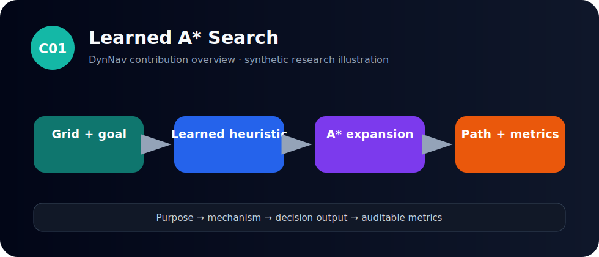
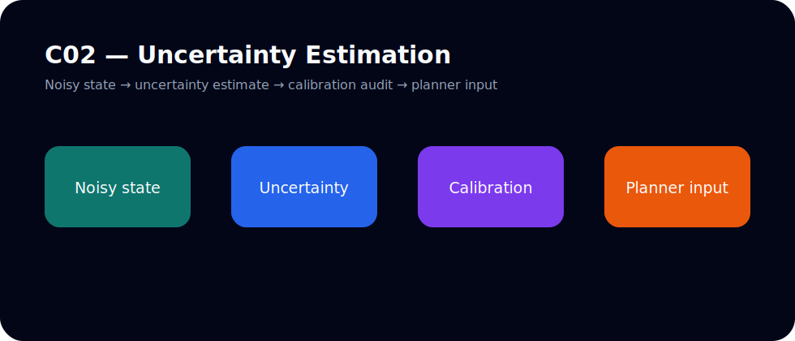
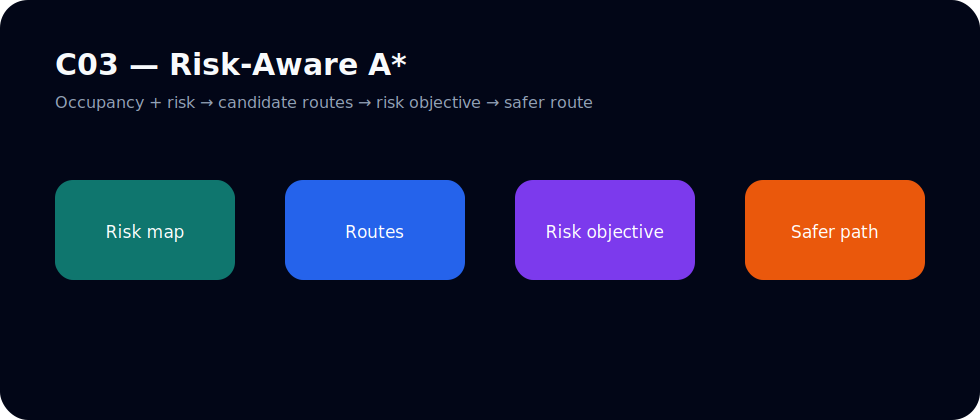
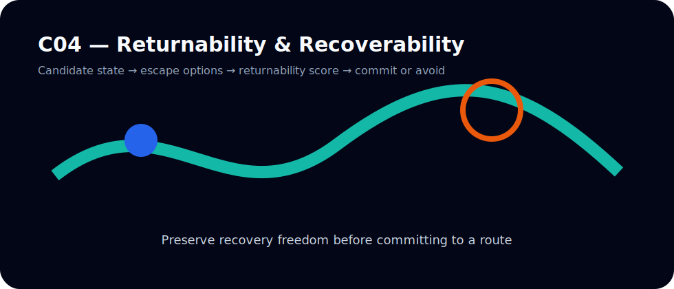
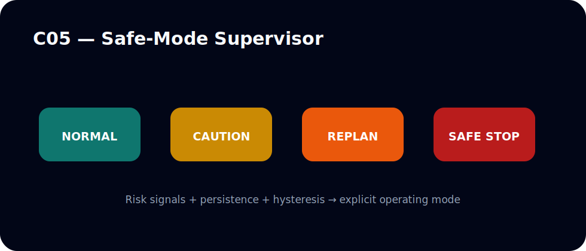
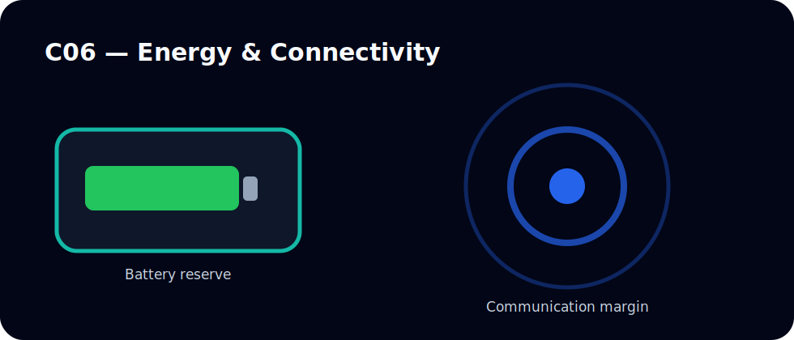
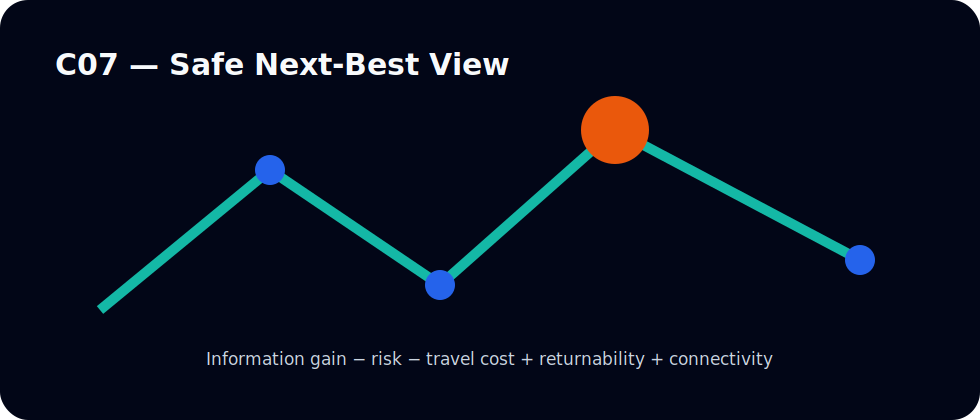

## Security, coordination, and human interaction

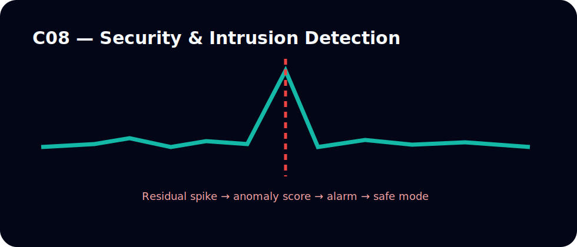
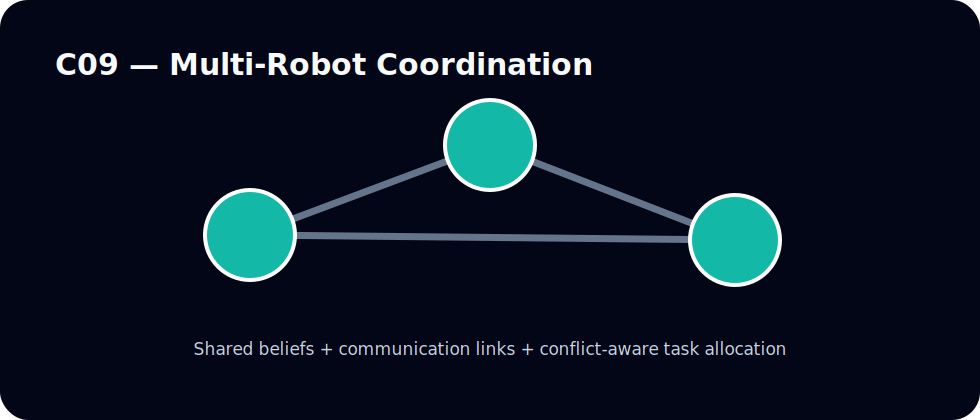
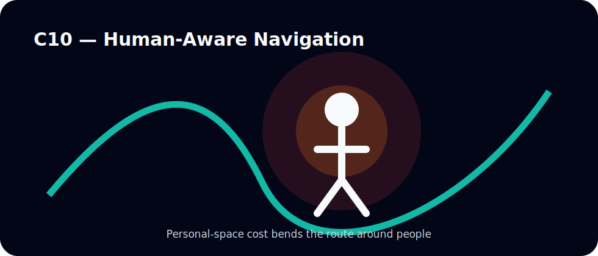

## Learning, prediction, mapping, and safety shields

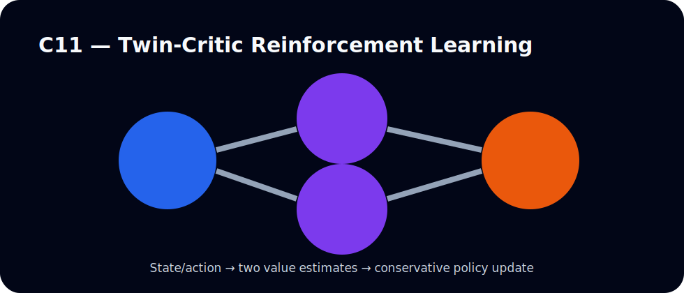
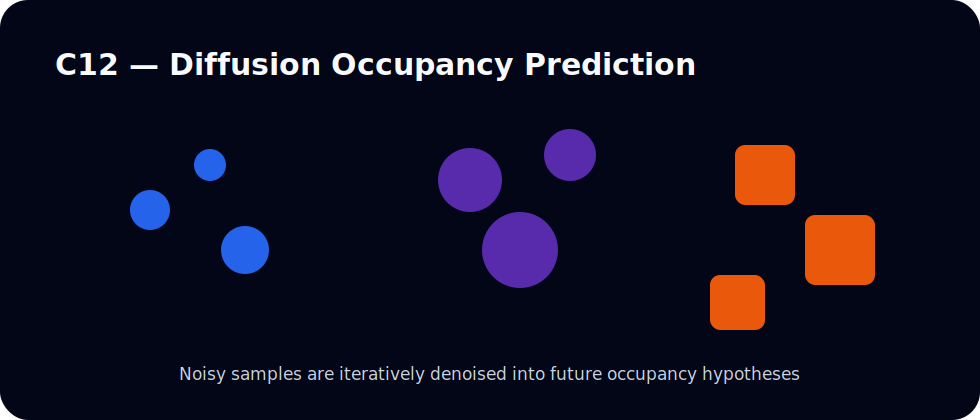
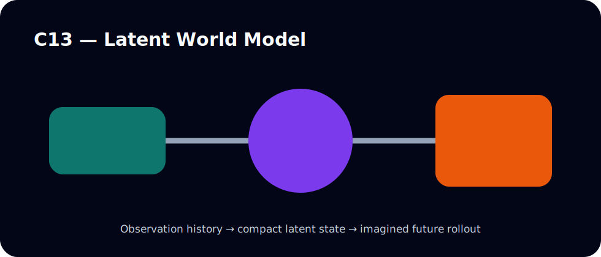
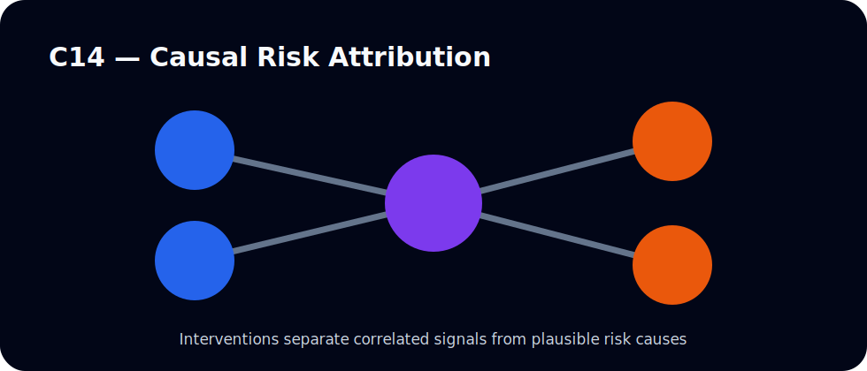
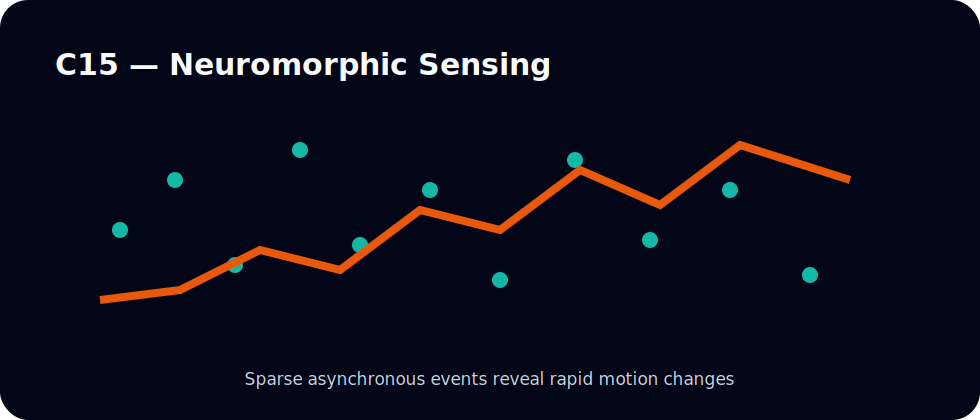
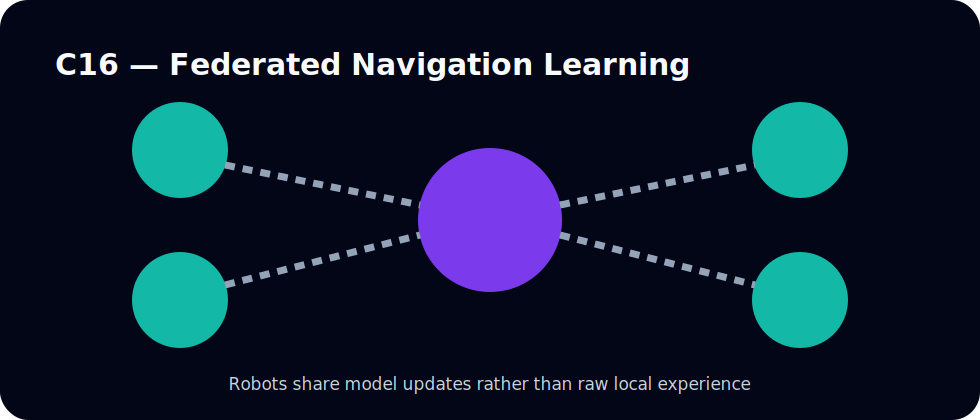
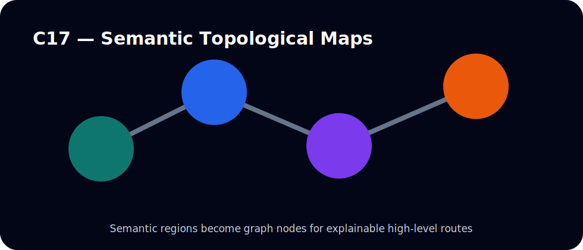
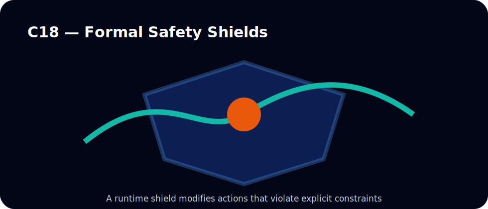

## Mission reasoning, scene representations, robustness, and swarms

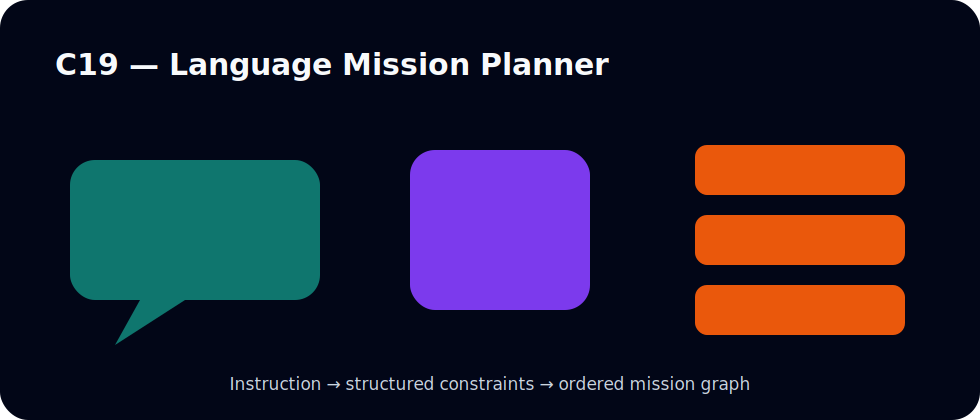
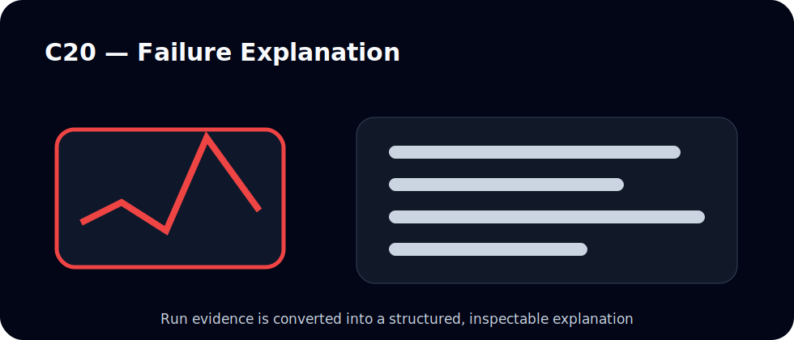
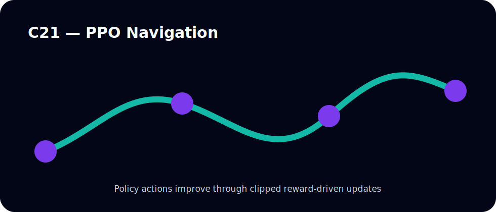
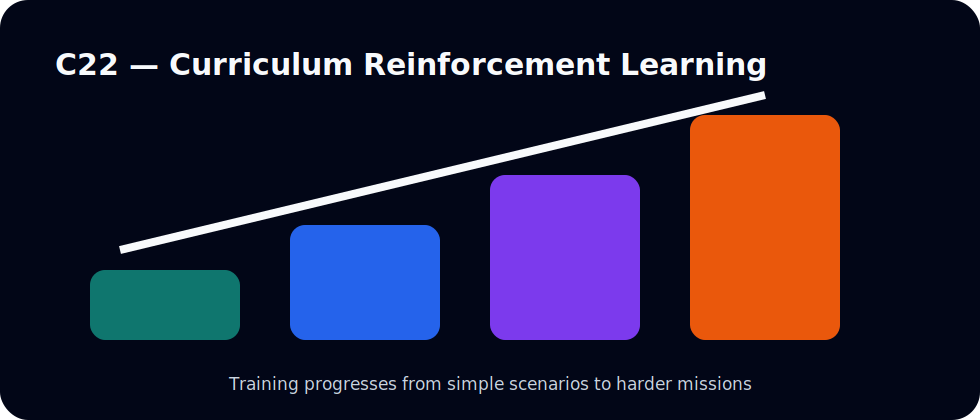
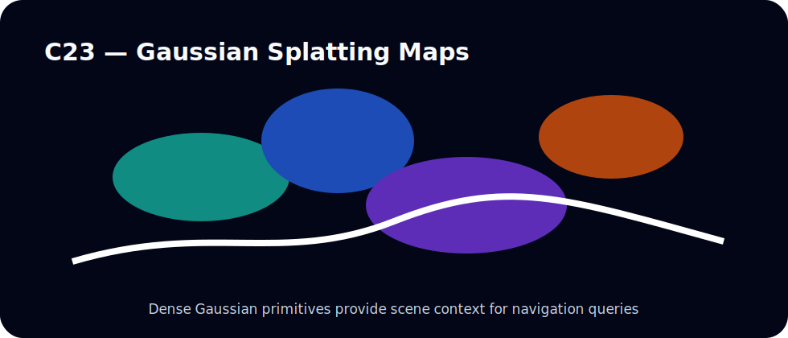
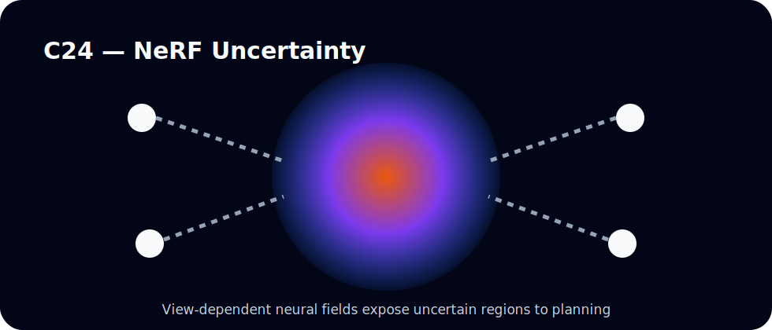
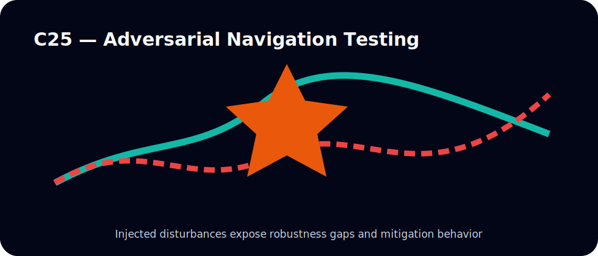
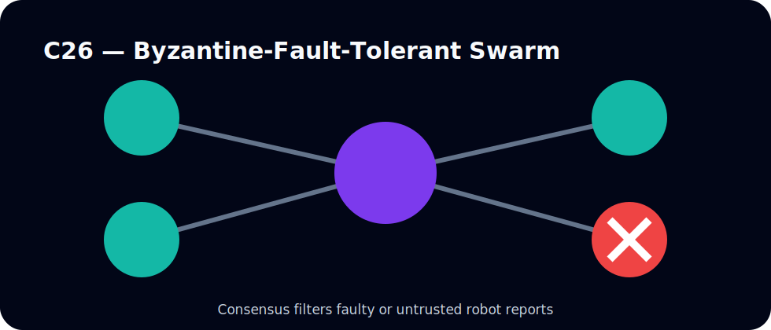
