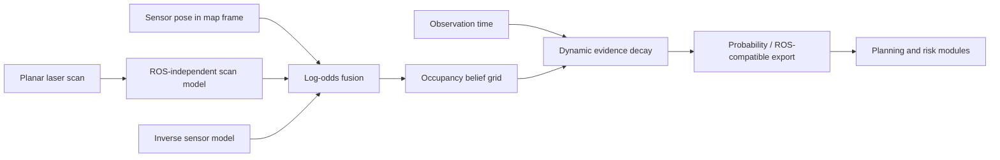

# Probabilistic Occupancy Mapping

## Purpose

The mapping module estimates a spatial occupancy belief from planar range measurements while preserving unknown space, probabilistic confidence, coordinate metadata, and observation age. It is middleware-independent and can therefore be tested without ROS 2 while remaining suitable for a thin `nav_msgs/OccupancyGrid` adapter.

## Architecture



## Mathematical model

For cell `m_i`, measurement `z_t`, and sensor pose `x_t`, DynNav uses bounded additive log odds:

```text
l_t(m_i) = clip(
    l_(t-1)(m_i)
    + inverse_sensor_log_odds(m_i | z_t, x_t)
    - l_0,
    l_min,
    l_max
)
```

The probability conversion is:

```text
p(m_i) = 1 / (1 + exp(-l_t(m_i)))
```

Free cells receive negative evidence and a finite beam endpoint receives positive evidence. A maximum-range or infinite return contributes free-space evidence only. NaN, non-positive, and below-minimum-range measurements are rejected.

Dynamic evidence is relaxed toward the prior after a configurable grace period. For age `a`, half-life `h`, and prior log odds `l_0`:

```text
l_decay = l_0 + (l - l_0) * 2^(-a/h)
```

This is an explicit recency model, not a motion tracker. It prevents obsolete occupied evidence from persisting indefinitely while preserving the fact that a cell has been observed.

## Interfaces

### Inputs

- `OccupancyGridMetadata`: dimensions, resolution, origin, and frame identifier.
- `InverseSensorModel`: prior, free, occupied, and saturation probabilities.
- `PlanarLaserScan`: ranges, angular geometry, range limits, and timestamp.
- sensor position and yaw in the map frame.

### Outputs

- read-only log-odds and observed-mask views;
- occupancy probability grid;
- ROS-compatible integer occupancy values (`-1`, `0..100`);
- per-update diagnostics: processed beams, ignored beams, cell updates, and unique touched cells.

## Complexity

For `B` beams and an average of `K` traversed cells per beam:

- scan update time: `O(BK)`;
- dynamic decay time: `O(WH)` for a `W x H` grid;
- storage: `O(WH)` for log odds, observation mask, and timestamps.

The current ray traversal uses integer Bresenham rasterization. This is deterministic and efficient for grid mapping, although supercover traversal may be preferable when every geometrically intersected cell must be represented.

## Configuration

The reproducible default configuration is in `configs/mapping.yaml`. All probabilities, thresholds, decay constants, geometry, and evaluation metrics are explicit.

## Tests

Run:

```bash
pytest tests/test_mapping_occupancy_grid.py
```

The tests cover coordinate conversion, hit/no-return fusion, out-of-map clipping, invalid measurements, saturation, dynamic decay, unknown-cell export, immutable public arrays, and invalid configuration.

## Evaluation protocol

A mapping experiment should report:

- scan update latency distribution;
- processed beams and touched cells;
- occupancy intersection-over-union against ground truth;
- false-free and false-occupied rates;
- map entropy over time;
- memory use as map dimensions increase.

Every result must include the map configuration, sensor model, seed, trajectory, scan log, and exact software revision.

## Limitations

- The current module assumes a known sensor pose in the map frame; localization uncertainty is not yet marginalized into the update.
- Temporal decay is not dynamic-object tracking.
- Measurements are fused independently, as in the classical occupancy-grid approximation.
- ROS 2 message conversion and SLAM Toolbox integration remain adapter-layer work.
- No formal safety guarantee follows from occupancy probabilities alone.

## Research contribution

This module replaces binary grid mutation with a reproducible Bayesian belief representation. It provides the uncertainty-bearing map required by risk-aware planning, online replanning, exploration, anomaly detection, and future belief-space methods.
